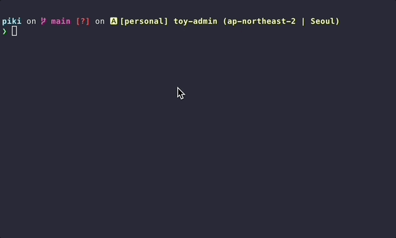

## 개요

gitmoji를 사용해서 커밋 메세지를 "일관성 있고 이쁘게" 꾸며봅시다.

&nbsp;

## 설치

macOS의 경우 패키지 관리자 homebrew를 사용해서 손쉽게 설치 가능합니다.

```bash
$ brew install gitmoji
```

설치 후 `gitmoji` 명령어가 동작하는지 확인합니다.

```bash
$ gitmoji --version
5.0.1
```

&nbsp;

## 사용하기

### 이모지 리스트 확인

gitmoji에서 사용할 수 있는 이모지 전체 리스트를 확인합니다.

```bash
$ gitmoji -l
```

```bash
🎨 - :art: - Improve structure / format of the code.
⚡️ - :zap: - Improve performance.
🔥 - :fire: - Remove code or files.
🐛 - :bug: - Fix a bug.
🚑️ - :ambulance: - Critical hotfix.
✨ - :sparkles: - Introduce new features.
📝 - :memo: - Add or update documentation.
🚀 - :rocket: - Deploy stuff.
💄 - :lipstick: - Add or update the UI and style files.
🎉 - :tada: - Begin a project.
✅ - :white_check_mark: - Add, update, or pass tests.
🔒️ - :lock: - Fix security issues.
🔐 - :closed_lock_with_key: - Add or update secrets.
🔖 - :bookmark: - Release / Version tags.
🚨 - :rotating_light: - Fix compiler / linter warnings.
🚧 - :construction: - Work in progress.
💚 - :green_heart: - Fix CI Build.
⬇️ - :arrow_down: - Downgrade dependencies.
⬆️ - :arrow_up: - Upgrade dependencies.
📌 - :pushpin: - Pin dependencies to specific versions.
👷 - :construction_worker: - Add or update CI build system.
📈 - :chart_with_upwards_trend: - Add or update analytics or track code.
♻️ - :recycle: - Refactor code.
➕ - :heavy_plus_sign: - Add a dependency.
➖ - :heavy_minus_sign: - Remove a dependency.
🔧 - :wrench: - Add or update configuration files.
🔨 - :hammer: - Add or update development scripts.
🌐 - :globe_with_meridians: - Internationalization and localization.
✏️ - :pencil2: - Fix typos.
💩 - :poop: - Write bad code that needs to be improved.
⏪️ - :rewind: - Revert changes.
🔀 - :twisted_rightwards_arrows: - Merge branches.
📦️ - :package: - Add or update compiled files or packages.
👽️ - :alien: - Update code due to external API changes.
🚚 - :truck: - Move or rename resources (e.g.: files, paths, routes).
📄 - :page_facing_up: - Add or update license.
💥 - :boom: - Introduce breaking changes.
🍱 - :bento: - Add or update assets.
♿️ - :wheelchair: - Improve accessibility.
💡 - :bulb: - Add or update comments in source code.
🍻 - :beers: - Write code drunkenly.
💬 - :speech_balloon: - Add or update text and literals.
🗃️ - :card_file_box: - Perform database related changes.
🔊 - :loud_sound: - Add or update logs.
🔇 - :mute: - Remove logs.
👥 - :busts_in_silhouette: - Add or update contributor(s).
🚸 - :children_crossing: - Improve user experience / usability.
🏗️ - :building_construction: - Make architectural changes.
📱 - :iphone: - Work on responsive design.
🤡 - :clown_face: - Mock things.
🥚 - :egg: - Add or update an easter egg.
🙈 - :see_no_evil: - Add or update a .gitignore file.
📸 - :camera_flash: - Add or update snapshots.
⚗️ - :alembic: - Perform experiments.
🔍️ - :mag: - Improve SEO.
🏷️ - :label: - Add or update types.
🌱 - :seedling: - Add or update seed files.
🚩 - :triangular_flag_on_post: - Add, update, or remove feature flags.
🥅 - :goal_net: - Catch errors.
💫 - :dizzy: - Add or update animations and transitions.
🗑️ - :wastebasket: - Deprecate code that needs to be cleaned up.
🛂 - :passport_control: - Work on code related to authorization, roles and permissions.
🩹 - :adhesive_bandage: - Simple fix for a non-critical issue.
🧐 - :monocle_face: - Data exploration/inspection.
⚰️ - :coffin: - Remove dead code.
🧪 - :test_tube: - Add a failing test.
👔 - :necktie: - Add or update business logic
🩺 - :stethoscope: - Add or update healthcheck.
🧱 - :bricks: - Infrastructure related changes.
🧑‍💻 - :technologist: - Improve developer experience
```

### gitmoji commit

```bash
# `git add` 절차는 평소대로 사용합니다.
# `git commit -m "..."` 명령어 대신 `gitmoji` 명령어를 사용합니다.
$ gitmoji -c
```

### gitmoji 데모

`gitmoji`로 Commit message를 작성하는 데모 영상입니다.



&nbsp;

## 참고자료

[Gitmoji 공식 홈페이지](https://gitmoji.dev/)
