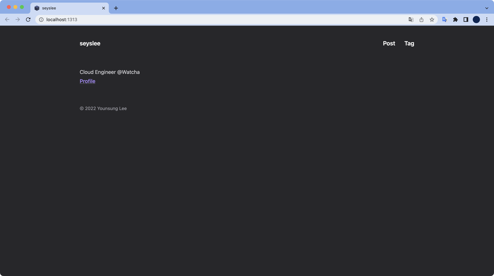

# 개요  

Hugo 테마인 congo의 버전을 업데이트하고 적용하는 방법을 소개한다.  

<br>

# 환경  

- **OS** : macOS Monterey 12.3.1
- **Shell** : zsh + oh-my-zsh
- **Hugo** : v0.98.0

<br>

# 방법  

**블로그 레포지터리의 root(/) 디렉토리로 이동**  

블로그 레포지터리의 루트 디렉토리로 이동한다.  

```bash
$ cd github/personal/seyslee.github.io
$ ls
archetypes config     content    data       go.mod     go.sum     layouts    public     resources  static
```

<br>

**테마 버전 확인**  

```bash
$ cat go.mod
module github.com/seyslee/seyslee.github.io

go 1.18

require github.com/jpanther/congo/v2 v2.1.3 // indirect
```

현재 사용중인 congo 테마의 버전은 `v2.1.3`이다.

<br>

**Congo 테마 업데이트 실행**  

```bash
$ hugo mod get -u
go: downloading github.com/jpanther/congo v1.6.4
go: downloading github.com/jpanther/congo/v2 v2.2.0
go: upgraded github.com/jpanther/congo/v2 v2.1.3 => v2.2.0
```

congo `v2.1.3`이 congo `v2.2.0`으로 업그레이드된 걸 확인할 수 있다.  

<br>

**변경사항 확인**  

```bash
$ hugo server -D
Start building sites …
hugo v0.98.0+extended darwin/arm64 BuildDate=unknown

                   | EN
-------------------+------
  Pages            | 129
  Paginator pages  |  27
  Non-page files   | 131
  Static files     |   9
  Processed images |   4
  Aliases          |  29
  Sitemaps         |   1
  Cleaned          |   0

Built in 204 ms
Watching for changes in /Users/xxxxx/github/personal/seyslee.github.io/{archetypes,content,data,layouts,static}
Watching for config changes in /Users/xxxxx/github/personal/seyslee.github.io/config/_default, /Users/xxxxx/github/personal/seyslee.github.io/go.mod
Environment: "development"
Serving pages from memory
Running in Fast Render Mode. For full rebuilds on change: hugo server --disableFastRender
Web Server is available at http://localhost:1313/ (bind address 127.0.0.1)
Press Ctrl+C to stop

```

블로그 테스트를 위해 Hugo 로컬 웹서버를 띄우고 http://localhost:1313/ 주소로 접속해본다.



실제로 변경사항을 확인해본다. 끝.

<br>

**tidy**

사용하지 않는 `go.sum`, `go.mod`의 엔트리를 정리해준다.
```bash
$ hugo mod tidy
```

<br>

**정리 전**
```bash
$ cat go.sum
github.com/jpanther/congo/v2 v2.1.3 h1:9f9HyLEc52EdIdzJmbDnwxh0UF20BbkGLO+D2XR/OPo=
github.com/jpanther/congo/v2 v2.1.3/go.mod h1:1S7DRoO1ZYS4YUdFd1LjTkdyjQwsjFWd8TqSfz3Jd+M=
github.com/jpanther/congo/v2 v2.2.0 h1:+NuF5XbEz15yd4GkSOSDUnIY0GRZ1vuunpxbzdVNaiY=
github.com/jpanther/congo/v2 v2.2.0/go.mod h1:1S7DRoO1ZYS4YUdFd1LjTkdyjQwsjFWd8TqSfz3Jd+M=
github.com/jpanther/congo/v2 v2.2.1 h1:h6L2HWX0XU19Q2rXiKSedeNmdjhxZ2vkT+/MWMtm5+E=
github.com/jpanther/congo/v2 v2.2.1/go.mod h1:1S7DRoO1ZYS4YUdFd1LjTkdyjQwsjFWd8TqSfz3Jd+M=
```

<br>

**tidy 실행**
```bash
$ hugo mod tidy
```

<br>

**정리 후**
```bash
$ cat go.sum
github.com/jpanther/congo/v2 v2.2.1 h1:h6L2HWX0XU19Q2rXiKSedeNmdjhxZ2vkT+/MWMtm5+E=
github.com/jpanther/congo/v2 v2.2.1/go.mod h1:1S7DRoO1ZYS4YUdFd1LjTkdyjQwsjFWd8TqSfz3Jd+M=
```

현재 사용중인 v2.2.1 엔트리 외에 나머지 사용하지 않는 엔트리들이 정리된 걸 확인할 수 있다.