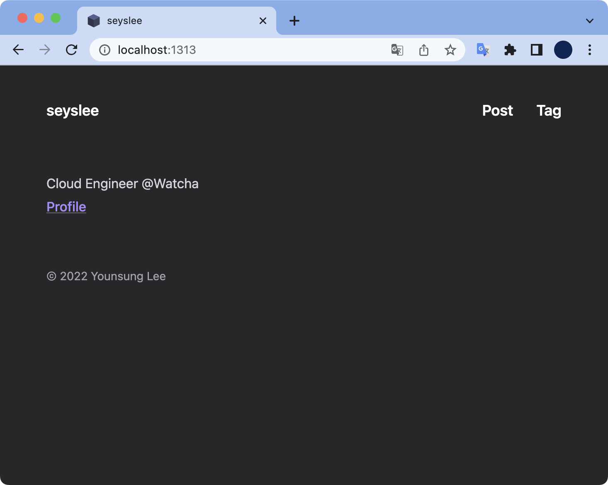

# 증상

로컬 Hugo 웹서버가 아래와 같은 메세지가 출력되면서 빌드되지 않음

```bash
$ hugo server -D
go: github.com/jpanther/congo/v2@v2.2.0: reading github.com/jpanther/congo/go.mod at revision v2.2.0: git ls-remote -q origin in /var/folders/lj/z8wcmg_s1cg7sswfjbkx07rr0000gn/T/hugo_cache/modules/filecache/modules/pkg/mod/cache/vcs/066af87f3ece5bb7d6b6b53ce98f8b34566e9be8285986a3e33bbfe82661fac4: exit status 128:
	fatal: 'origin' does not appear to be a git repository
	fatal: Could not read from remote repository.

	Please make sure you have the correct access rights
	and the repository exists.
hugo: collected modules in 767 ms
Error: failed to download modules: failed to execute 'go [mod download]': failed to execute binary "go" with args [mod download]: go: github.com/jpanther/congo/v2@v2.2.0: reading github.com/jpanther/congo/go.mod at revision v2.2.0: git ls-remote -q origin in /var/folders/lj/z8wcmg_s1cg7sswfjbkx07rr0000gn/T/hugo_cache/modules/filecache/modules/pkg/mod/cache/vcs/066af87f3ece5bb7d6b6b53ce98f8b34566e9be8285986a3e33bbfe82661fac4: exit status 128:
	fatal: 'origin' does not appear to be a git repository
	fatal: Could not read from remote repository.

	Please make sure you have the correct access rights
	and the repository exists.
 *errors.errorString
```

<br>

# 환경

- **OS** : macOS Monterey 12.3.1
- **Shell** : zsh + oh-my-zsh
- **hugo v0.98.0**
- **Git version 2.32.0 (Apple Git-132)**

<br>

# 해결방법

- remote 재등록
- hugo 캐시 전체 클리어

<br>

### remote 재등록

등록되어 있는 remote 목록을 확인한다.

```bash
$ git remote -v
origin	git@github.com-seyslee:seyslee/seyslee.github.io.git (fetch)
origin	git@github.com-seyslee:seyslee/seyslee.github.io.git (push)
```

<br>

기존에 등록된 origin을 삭제한다.

```bash
$ git remote remove origin
```

origin을 다시 재등록한다.

```bash
$ git remote add origin git@github.com-seyslee:seyslee/seyslee.github.io.git
```

<br>

### hugo 모듈 캐시 전체 삭제

```bash
$ hugo mod clean --all
go: github.com/jpanther/congo/v2@v2.2.0: reading github.com/jpanther/congo/go.mod at revision v2.2.0: git ls-remote -q origin in /var/folders/lj/z8wcmg_s1cg7sswfjbkx07rr0000gn/T/hugo_cache/modules/filecache/modules/pkg/mod/cache/vcs/066af87f3ece5bb7d6b6b53ce98f8b34566e9be8285986a3e33bbfe82661fac4: exit status 128:
	fatal: 'origin' does not appear to be a git repository
	fatal: Could not read from remote repository.

	Please make sure you have the correct access rights
	and the repository exists.
WARN 2022/05/15 10:45:39 failed to download modules: failed to execute 'go [mod download]': failed to execute binary "go" with args [mod download]: go: github.com/jpanther/congo/v2@v2.2.0: reading github.com/jpanther/congo/go.mod at revision v2.2.0: git ls-remote -q origin in /var/folders/lj/z8wcmg_s1cg7sswfjbkx07rr0000gn/T/hugo_cache/modules/filecache/modules/pkg/mod/cache/vcs/066af87f3ece5bb7d6b6b53ce98f8b34566e9be8285986a3e33bbfe82661fac4: exit status 128:
	fatal: 'origin' does not appear to be a git repository
	fatal: Could not read from remote repository.

	Please make sure you have the correct access rights
	and the repository exists.
 *errors.errorString
Deleted 200 files from module cache.
```

`--all` : 전체 캐시 모듈을 삭제하는 옵션  
200개의 모듈 캐시 파일이 삭제되었다.

<br>

이후 Hugo 로컬 웹서버를 다시 시작한다.

```bash
$ hugo server -D
hugo: downloading modules …
hugo: collected modules in 3920 ms
Start building sites …
hugo v0.98.0+extended darwin/arm64 BuildDate=unknown

                   | EN
-------------------+------
  Pages            | 129
  Paginator pages  |  27
  Non-page files   | 131
  Static files     |   9
  Processed images |   4
  Aliases          |  29
  Sitemaps         |   1
  Cleaned          |   0

Built in 232 ms
Watching for changes in /Users/steve/github/personal/seyslee.github.io/{archetypes,content,data,layouts,static}
Watching for config changes in /Users/steve/github/personal/seyslee.github.io/config/_default, /Users/steve/github/personal/seyslee.github.io/go.mod
Environment: "development"
Serving pages from memory
Running in Fast Render Mode. For full rebuilds on change: hugo server --disableFastRender
Web Server is available at http://localhost:1313/ (bind address 127.0.0.1)
Press Ctrl+C to stop
```

모듈 캐시를 클리어한 후에는 문제없이 동작한다.



로컬 웹서버에 접속한 결과 정상적으로 휴고 블로그 화면이 표출된다.