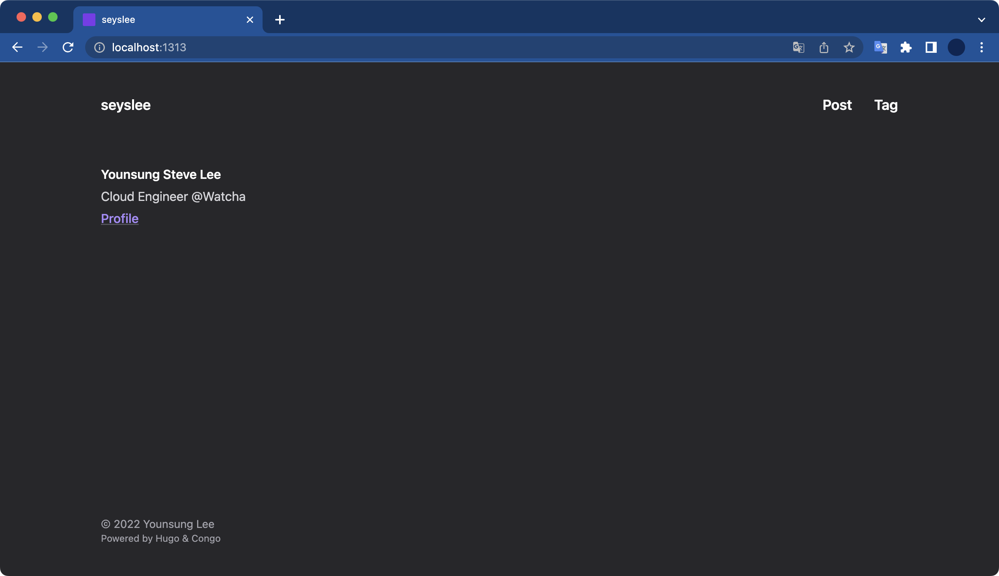

# 증상

**에러 내용**  
`Error: File “not found” or “failed to extract”`

<br>  
  
**상세 증상**  

- 블로그 게시글을 작성하고 로컬 테스트를 실행할 때 `You should create a template file ...` 에러 메세지가 출력된다.  

- 웹 브라우저로 블로그 로컬 테스트 페이지(`http://localhost:1313`)에 접속하면 빈 페이지가 나타난다.  

```bash
$ hugo server -D
go: no module dependencies to download
hugo: downloading modules …
go: downloading github.com/jpanther/congo v1.6.4
go: added github.com/jpanther/congo/v2 v2.1.3
hugo: collected modules in 3356 ms
Start building sites …
hugo v0.98.0+extended darwin/arm64 BuildDate=unknown
WARN 2022/05/01 11:45:52 found no layout file for "HTML" for kind "home": You should create a template file which matches Hugo Layouts Lookup Rules for this combination.
WARN 2022/05/01 11:45:52 found no layout file for "HTML" for kind "section": You should create a template file which matches Hugo Layouts Lookup Rules for this combination.
WARN 2022/05/01 11:45:52 found no layout file for "HTML" for kind "taxonomy": You should create a template file which matches Hugo Layouts Lookup Rules for this combination.
WARN 2022/05/01 11:45:52 found no layout file for "HTML" for kind "taxonomy": You should create a template file which matches Hugo Layouts Lookup Rules for this combination.
WARN 2022/05/01 11:45:52 found no layout file for "HTML" for kind "term": You should create a template file which matches Hugo Layouts Lookup Rules for this combination.
WARN 2022/05/01 11:45:52 found no layout file for "HTML" for kind "term": You should create a template file which matches Hugo Layouts Lookup Rules for this combination.
WARN 2022/05/01 11:45:52 found no layout file for "HTML" for kind "term": You should create a template file which matches Hugo Layouts Lookup Rules for this combination.
WARN 2022/05/01 11:45:52 found no layout file for "HTML" for kind "term": You should create a template file which matches Hugo Layouts Lookup Rules for this combination.
WARN 2022/05/01 11:45:52 found no layout file for "HTML" for kind "term": You should create a template file which matches Hugo Layouts Lookup Rules for this combination.
WARN 2022/05/01 11:45:52 found no layout file for "HTML" for kind "term": You should create a template file which matches Hugo Layouts Lookup Rules for this combination.
WARN 2022/05/01 11:45:52 found no layout file for "HTML" for kind "term": You should create a template file which matches Hugo Layouts Lookup Rules for this combination.
WARN 2022/05/01 11:45:52 found no layout file for "HTML" for kind "term": You should create a template file which matches Hugo Layouts Lookup Rules for this combination.
WARN 2022/05/01 11:45:52 found no layout file for "HTML" for kind "term": You should create a template file which matches Hugo Layouts Lookup Rules for this combination.
WARN 2022/05/01 11:45:52 found no layout file for "HTML" for kind "term": You should create a template file which matches Hugo Layouts Lookup Rules for this combination.
WARN 2022/05/01 11:45:52 found no layout file for "HTML" for kind "term": You should create a template file which matches Hugo Layouts Lookup Rules for this combination.
WARN 2022/05/01 11:45:52 found no layout file for "HTML" for kind "term": You should create a template file which matches Hugo Layouts Lookup Rules for this combination.
WARN 2022/05/01 11:45:52 found no layout file for "HTML" for kind "term": You should create a template file which matches Hugo Layouts Lookup Rules for this combination.
WARN 2022/05/01 11:45:52 found no layout file for "HTML" for kind "term": You should create a template file which matches Hugo Layouts Lookup Rules for this combination.
WARN 2022/05/01 11:45:52 found no layout file for "HTML" for kind "term": You should create a template file which matches Hugo Layouts Lookup Rules for this combination.
WARN 2022/05/01 11:45:52 found no layout file for "HTML" for kind "term": You should create a template file which matches Hugo Layouts Lookup Rules for this combination.
WARN 2022/05/01 11:45:52 found no layout file for "HTML" for kind "term": You should create a template file which matches Hugo Layouts Lookup Rules for this combination.
WARN 2022/05/01 11:45:52 found no layout file for "HTML" for kind "term": You should create a template file which matches Hugo Layouts Lookup Rules for this combination.
WARN 2022/05/01 11:45:52 found no layout file for "HTML" for kind "term": You should create a template file which matches Hugo Layouts Lookup Rules for this combination.
WARN 2022/05/01 11:45:52 found no layout file for "HTML" for kind "term": You should create a template file which matches Hugo Layouts Lookup Rules for this combination.
WARN 2022/05/01 11:45:52 found no layout file for "HTML" for kind "term": You should create a template file which matches Hugo Layouts Lookup Rules for this combination.
WARN 2022/05/01 11:45:52 found no layout file for "HTML" for kind "term": You should create a template file which matches Hugo Layouts Lookup Rules for this combination.
WARN 2022/05/01 11:45:52 found no layout file for "HTML" for kind "term": You should create a template file which matches Hugo Layouts Lookup Rules for this combination.
WARN 2022/05/01 11:45:52 found no layout file for "HTML" for kind "term": You should create a template file which matches Hugo Layouts Lookup Rules for this combination.
WARN 2022/05/01 11:45:52 found no layout file for "HTML" for kind "term": You should create a template file which matches Hugo Layouts Lookup Rules for this combination.
WARN 2022/05/01 11:45:52 found no layout file for "HTML" for kind "term": You should create a template file which matches Hugo Layouts Lookup Rules for this combination.
WARN 2022/05/01 11:45:52 found no layout file for "HTML" for kind "term": You should create a template file which matches Hugo Layouts Lookup Rules for this combination.
WARN 2022/05/01 11:45:52 found no layout file for "JSON" for kind "home": You should create a template file which matches Hugo Layouts Lookup Rules for this combination.

                   | EN
-------------------+------
  Pages            |  32
  Paginator pages  |   0
  Non-page files   | 126
  Static files     |   2
  Processed images |   0
  Aliases          |   0
  Sitemaps         |   1
  Cleaned          |   0

Built in 218 ms
Watching for changes in /Users/steve/github/personal/seyslee.github.io/{archetypes,content,data,layouts,static}
Watching for config changes in /Users/steve/github/personal/seyslee.github.io/config/_default, /Users/steve/github/personal/seyslee.github.io/go.mod
Environment: "development"
Serving pages from memory
Running in Fast Render Mode. For full rebuilds on change: hugo server --disableFastRender
Web Server is available at http://localhost:1313/ (bind address 127.0.0.1)
Press Ctrl+C to stop
WARN 2022/05/01 11:45:55 found no layout file for "HTML" for kind "home": You should create a template file which matches Hugo Layouts Lookup Rules for this combination.
WARN 2022/05/01 11:45:55 found no layout file for "JSON" for kind "home": You should create a template file which matches Hugo Layouts Lookup Rules for this combination.
```

<br>  
  
# 해결방법  

Hugo가 Hugo 테마 모듈을 찾지 못할 때 발생하는 에러이다.  
이슈를 해결하기 위해 Hugo 모듈의 캐시 데이터를 삭제한다.  

```bash
# Delete the Hugo Module cache for the current project.
$ hugo mod clean

# Run hugo web server for testing.
$ hugo server
```

<br>

그래도 문제가 해결되지 않으면 Hugo의 캐시를 지운 후 최신 휴고 테마(모듈)의 새 복사본을 가져오는 것이 좋다.  

```bash
# Delete the Hugo Module cache for the current project.
$ hugo mod clean

# Install the latest versions of all module dependencies.
$ hugo mod get -u ./...

# Run hugo web server for testing.
$ hugo server
```

<br>  
  
**조치 후 상태 확인**  

위 조치방법으로 조치한 후, 로컬 휴고 웹서버를 다시 띄워보니 잘 되는 걸 확인할 수 있다.  

```bash
hugo server -D
Start building sites …
hugo v0.98.0+extended darwin/arm64 BuildDate=unknown

                   | EN
-------------------+------
  Pages            | 125
  Paginator pages  |  26
  Non-page files   | 126
  Static files     |   8
  Processed images |   4
  Aliases          |  28
  Sitemaps         |   1
  Cleaned          |   0

Built in 203 ms
Watching for changes in /Users/steve/github/personal/seyslee.github.io/{archetypes,content,data,layouts,static}
Watching for config changes in /Users/steve/github/personal/seyslee.github.io/config/_default, /Users/steve/github/personal/seyslee.github.io/go.mod
Environment: "development"
Serving pages from memory
Running in Fast Render Mode. For full rebuilds on change: hugo server --disableFastRender
Web Server is available at http://localhost:1313/ (bind address 127.0.0.1)
Press Ctrl+C to stop
```

<br>

로컬 웹페이지 주소(`localhost:1313`)에 접속해도 정상적으로 표시된다.  

  

<br>  
  
# 참고자료  

https://wowchemy.com/docs/hugo-tutorials/troubleshooting/#error-file-not-found-or-failed-to-extract