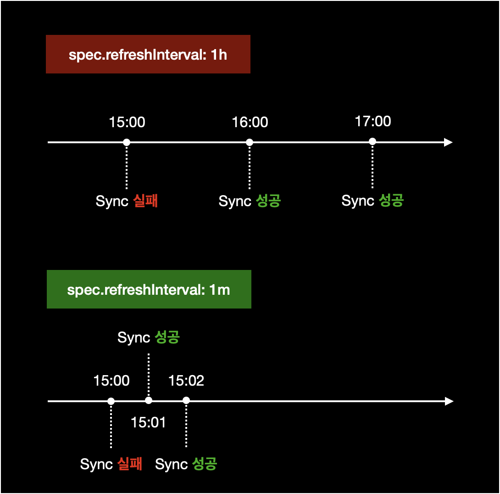

# External Secrets 최초 싱크 버그

## 증상

External Secrets `v0.4.4` 버전을 사용 중입니다.  
External Secrets을 ArgoCD에 배포했을 경우 처음 한 번은 무조건 Sync 실패가 발생하는 버그가 있습니다.

```bash
$ helm list -A -f 'external-secrets'
NAME            	NAMESPACE       	REVISION	UPDATED                             	STATUS  	CHART                 	APP VERSION
external-secrets	external-secrets	2       	2022-05-10 11:13:09.719108 +0900 KST	deployed	external-secrets-0.4.4	v0.4.4
```

ArgoCD에서 Application을 배포하면 External Secret에서 다음과 같은 오류 메세지가 발생하며 싱크에 실패하고 degraded 상태가 됩니다.

```bash
Operation cannot be fulfilled on secrets "sample-application-name-here": the object has been modified; please apply your changes to the latest version and try again
```

&nbsp;

## 원인

External Secret `v0.4.4`에서 발생하는 버그입니다.

&nbsp;

## 해결방법

### 근본적인 해결방안

근본적인 해결방법은 External Secrets 릴리즈를 v0.4.4에서 최신 버전으로 업그레이드하면 됩니다.

&nbsp;

### 대안

하지만 여러가지 이유로 External Secrets 버전 업그레이드가 불가능한 상황일 경우, External Secret의 spec 설정을 수정해서 싱크 문제를 해결할 수도 있습니다.

ArgoCD에 Application을 배포할 때 External Secrets 리소스의 `spec.refreshInterval` 주기를 더 짧게 설정합니다.



&nbsp;

문제가 발생한 ExternalSecrets의 yaml 파일입니다.

```yaml
apiVersion: external-secrets.io/v1alpha1
kind: ExternalSecret
metadata:
  ...
spec:
  refreshInterval: 1h
  ...
```

`spec.refreshInterval` 기본값은 1시간(`1h`)입니다.

&nbsp;

`spec.refreshInterval` 설정을 `1h`에서 `1m`으로 변경합니다.

```yaml
apiVersion: external-secrets.io/v1alpha1
kind: ExternalSecret
metadata:
  ...
spec:
  # Change `refreshInterval` 1h to 1m.
  refreshInterval: 1m
  ...
```

&nbsp;

`refreshInterval` 값을 수정한 후 ArgoCD에 재배포하면 정상적으로 싱크된 걸 확인할 수 있습니다.

```bash
$ kubectl get externalsecrets.external-secrets.io -n your-namespace
NAME                      STORE             REFRESH INTERVAL   STATUS
testweb-testweb-cred      secrets-manager   1m                 SecretSynced
testweb-datadog-env       secrets-manager   1m                 SecretSynced
testweb-fluentbit-cred    secrets-manager   1m                 SecretSynced
```
