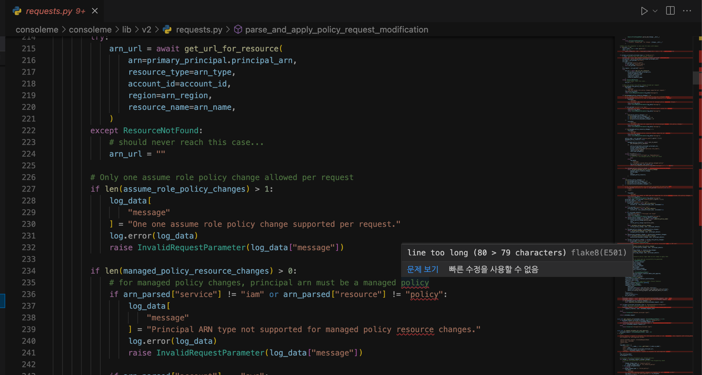
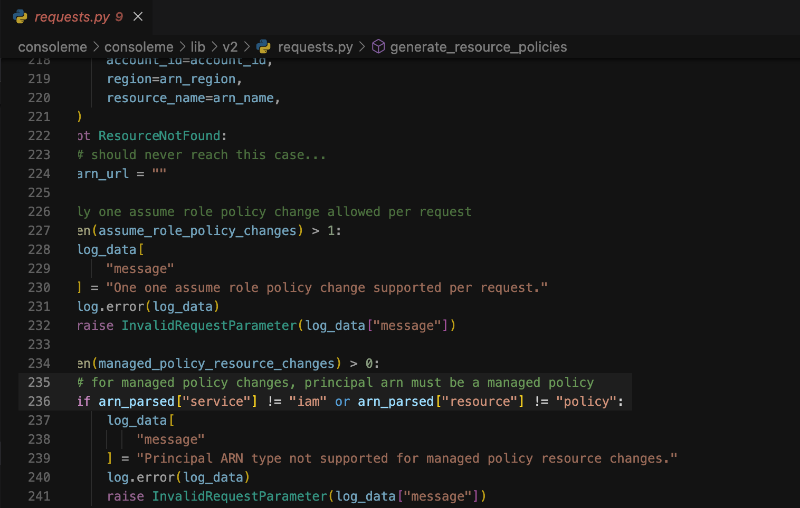

# 문제점

파이썬 스타일 가이드 문서인 PEP 8에는 E501이라는 규칙이 있다.  

한 라인의 글자수는 79자 이하여야 한다는 규칙인데, 이 룰이 사실 지키기 제일 어려운 룰이다.  

특히 들여쓰기<sup>Indent</sup>로 블럭을 구분하는 파이썬이라는 언어 특성 때문에 변수 몇개만 쓰면 금방 한 라인에 79자를 넘어버리게 된다.  

그래서 이 E501 룰이 적절한지, 과한지에 대한 찬반 의견도 탕수육 부먹 대 찍먹 수준으로 첨예하다.



이제 너무 엄격한 E501 룰을 좀 루즈하게 풀려고 한다. 글자수를 79자에서 100자로 늘려서 사용하기로 한다.  

파이썬 문법 검사기에는 pylint, mypy, pylama 등 여러가지가 있다. 이 설정방법은 flake8 이라는 파이썬 문법 검사기에만 해당된다.  

<br>

# 환경

- **OS** : macOS Monterey 12.3.1
- **Visual Studio Code** : 1.67.0
- **Python 문법 검사기** : flake8 4.0.1 (pip instal로 설치)
  
  ```bash
  $ flake8 --version
  4.0.1 (mccabe: 0.6.1, pycodestyle: 2.8.0, pyflakes: 2.4.0) CPython 3.9.12 on Darwin
  ```

<br>

# 해결방법
Visual Studio Code의 설정파일을 열고 flake8의 글자수 제한 파라미터 값을 추가해주면 된다.

<br>

Visual Studio Code의 작업 디렉토리에 `.vscode` 디렉토리 존재를 확인할 수 있다.  

```bash
$ ls -al
total 24
drwxr-xr-x   8 steve  staff   256  5 12 17:56 .
drwxr-xr-x   5 steve  staff   160  4 18 12:37 ..
-rw-r--r--@  1 steve  staff  6148  5 10 09:30 .DS_Store
drwxr-xr-x   3 steve  staff    96  5 12 19:03 .vscode
```

<br>

```bash
$ cd .vscode
$ ls
settings.json
```

`settings.json` 파일의 수정이 필요하다.

<br>

```json
$ cat settings.json
{
  "python.linting.flake8Enabled": true,
  "python.linting.enabled": true,
  "python.linting.pylintEnabled": false,
  "python.linting.pycodestyleEnabled": false
}
```

<br>

**방법1. 글자수만 변경하기**  
```json
$ cat settings.json
{
  "python.linting.flake8Enabled": true,
  "python.linting.flake8Args": [
    "--max-line-length=100",
  ],
  "python.linting.enabled": true,
  "python.linting.pylintEnabled": false,
  "python.linting.pycodestyleEnabled": false
}
```

`--max-line-length=100` 값을 넣어준다.

<br>

**방법2. 룰을 무시하기**  
```json
$ cat settings.json
{
  "python.linting.flake8Enabled": true,
  "python.linting.flake8Args": [
    "--ignore=E501",
  ],
  "python.linting.enabled": true,
  "python.linting.pylintEnabled": false,
  "python.linting.pycodestyleEnabled": false
}
```

`--ignore=<RULE_NUMBER>`을 입력하면 된다.  

<br>



E501 룰에 대한 글자수 제한을 79자에서 100자로 늘린 후부터 flake8에서 해당 라인이 글자수를 넘었다는 지적을 하질 않는다.  