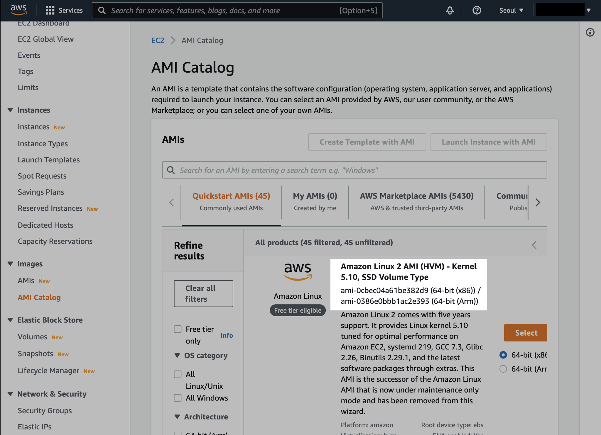
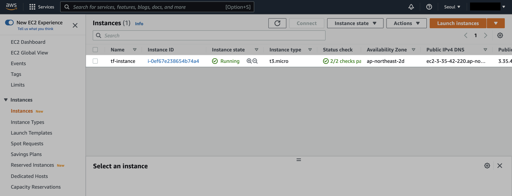
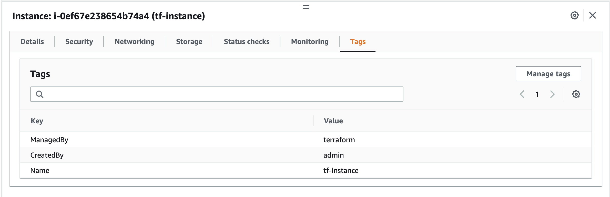
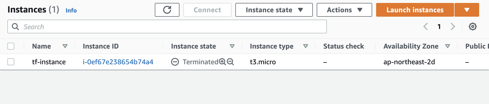

# 0. EC2 Instance

## 실습환경

실습 환경은 다음과 같습니다.

- **OS** : macOS Monterey 12.4 (M1 Pro)
- **Shell** : zsh + oh-my-zsh
- **Terraform** : Terraform v1.2.2
- **AWS CLI** : aws-cli/2.7.6

## 사전준비

테라폼으로 리소스를 생성할 권한을 얻기 위해 AWS CLI의 인증정보를 구성합니다.

```bash
$ aws configure
```

Access Key, Secret Key를 등록한 후 AWS Credential의 설정 정보를 확인합니다.

```bash
$ aws configure list
      Name                    Value             Type    Location
      ----                    -----             ----    --------
   profile                toy-admin              env    ['AWS_PROFILE', 'AWS_DEFAULT_PROFILE']
access_key     ****************W4KG shared-credentials-file
secret_key     ****************8uqa shared-credentials-file
    region           ap-northeast-2      config-file    ~/.aws/config
```

자신의 현재 IAM 권한이 무엇인지 확인합니다.

```json
$ aws sts get-caller-identity
{
    "UserId": "AIDAXQOVWG6FYM3OPCLJX",
    "Account": "123456789012",
    "Arn": "arn:aws:iam::123456789012:user/toy-admin"
}
```

## 코드 작성

```bash
$ ls
instance.tf versions.tf
```

```json
terraform-demo
├── instance.tf
└── versions.tf
```

```json
$ cat instance.tf
provider "aws" {
  region = "ap-northeast-2"
}

resource "aws_instance" "example" {
  # [Tips]
  # AMI ID `ami-0cbec04a61be382d9` means
  # Amazon Linux 2 AMI (HVM) - Kernel 5.10
  # SSD Volume Type on ap-northeast-2.
  ami           = "ami-0cbec04a61be382d9"
  instance_type = "t3.micro"

  tags = {
    Name = "tf-instance"
    CreatedBy = "admin"
    ManagedBy = "terraform"
  }
}
```

AMI ID는 AMI Catalogs에서 확인 가능합니다.

실습에서는 2022년 6월 기준 최신 버전의 Amazon Linux 2 이미지를 사용합니다.



```json
$ cat versions.tf
terraform {
  required_version = ">= 0.12"
}
```

## init, plan, apply

```bash
$ terraform init

Initializing the backend...

Initializing provider plugins...
- Finding latest version of hashicorp/aws...
- Installing hashicorp/aws v4.17.1...
- Installed hashicorp/aws v4.17.1 (signed by HashiCorp)

Terraform has created a lock file .terraform.lock.hcl to record the provider
selections it made above. Include this file in your version control repository
so that Terraform can guarantee to make the same selections by default when
you run "terraform init" in the future.

Terraform has been successfully initialized!

You may now begin working with Terraform. Try running "terraform plan" to see
any changes that are required for your infrastructure. All Terraform commands
should now work.

If you ever set or change modules or backend configuration for Terraform,
rerun this command to reinitialize your working directory. If you forget, other
commands will detect it and remind you to do so if necessary.
```

plan으로 생성될 리소스 정보를 미리 확인합니다.

```bash
$ terraform plan

Terraform used the selected providers to generate
the following execution plan. Resource actions are
indicated with the following symbols:
  + create

Terraform will perform the following actions:

  # aws_instance.example will be created
  + resource "aws_instance" "example" {
      + ami                                  = "ami-0cbec04a61be382d9"
      + arn                                  = (known after apply)
      + associate_public_ip_address          = (known after apply)
      + availability_zone                    = (known after apply)
      + cpu_core_count                       = (known after apply)
      + cpu_threads_per_core                 = (known after apply)
      + disable_api_termination              = (known after apply)
      + ebs_optimized                        = (known after apply)
      + get_password_data                    = false
      + host_id                              = (known after apply)
      + id                                   = (known after apply)
      + instance_initiated_shutdown_behavior = (known after apply)
      + instance_state                       = (known after apply)
      + instance_type                        = "t3.micro"
      + ipv6_address_count                   = (known after apply)
      + ipv6_addresses                       = (known after apply)
      + key_name                             = (known after apply)
      + monitoring                           = (known after apply)
      + outpost_arn                          = (known after apply)
      + password_data                        = (known after apply)
      + placement_group                      = (known after apply)
      + placement_partition_number           = (known after apply)
      + primary_network_interface_id         = (known after apply)
      + private_dns                          = (known after apply)
      + private_ip                           = (known after apply)
      + public_dns                           = (known after apply)
      + public_ip                            = (known after apply)
      + secondary_private_ips                = (known after apply)
      + security_groups                      = (known after apply)
      + source_dest_check                    = true
      + subnet_id                            = (known after apply)
      + tags                                 = {
          + "CreatedBy" = "admin"
          + "ManagedBy" = "terraform"
          + "Name"      = "tf-instance"
        }
      + tags_all                             = {
          + "CreatedBy" = "admin"
          + "ManagedBy" = "terraform"
          + "Name"      = "tf-instance"
        }
      + tenancy                              = (known after apply)
      + user_data                            = (known after apply)
      + user_data_base64                     = (known after apply)
      + user_data_replace_on_change          = false
      + vpc_security_group_ids               = (known after apply)

      + capacity_reservation_specification {
          + capacity_reservation_preference = (known after apply)

          + capacity_reservation_target {
              + capacity_reservation_id                 = (known after apply)
              + capacity_reservation_resource_group_arn = (known after apply)
            }
        }

      + ebs_block_device {
          + delete_on_termination = (known after apply)
          + device_name           = (known after apply)
          + encrypted             = (known after apply)
          + iops                  = (known after apply)
          + kms_key_id            = (known after apply)
          + snapshot_id           = (known after apply)
          + tags                  = (known after apply)
          + throughput            = (known after apply)
          + volume_id             = (known after apply)
          + volume_size           = (known after apply)
          + volume_type           = (known after apply)
        }

      + enclave_options {
          + enabled = (known after apply)
        }

      + ephemeral_block_device {
          + device_name  = (known after apply)
          + no_device    = (known after apply)
          + virtual_name = (known after apply)
        }

      + maintenance_options {
          + auto_recovery = (known after apply)
        }

      + metadata_options {
          + http_endpoint               = (known after apply)
          + http_put_response_hop_limit = (known after apply)
          + http_tokens                 = (known after apply)
          + instance_metadata_tags      = (known after apply)
        }

      + network_interface {
          + delete_on_termination = (known after apply)
          + device_index          = (known after apply)
          + network_card_index    = (known after apply)
          + network_interface_id  = (known after apply)
        }

      + root_block_device {
          + delete_on_termination = (known after apply)
          + device_name           = (known after apply)
          + encrypted             = (known after apply)
          + iops                  = (known after apply)
          + kms_key_id            = (known after apply)
          + tags                  = (known after apply)
          + throughput            = (known after apply)
          + volume_id             = (known after apply)
          + volume_size           = (known after apply)
          + volume_type           = (known after apply)
        }
    }

Plan: 1 to add, 0 to change, 0 to destroy.

────────────────────────────────────────────────────

Note: You didn't use the -out option to save this
plan, so Terraform can't guarantee to take exactly
these actions if you run "terraform apply" now.
```

1개의 리소스가 생성될 예정입니다.

```bash
$ terraform apply

Terraform used the selected providers to generate
the following execution plan. Resource actions are
indicated with the following symbols:
  + create

Terraform will perform the following actions:

  # aws_instance.example will be created
  + resource "aws_instance" "example" {
      + ami                                  = "ami-0cbec04a61be382d9"
      + arn                                  = (known after apply)
      + associate_public_ip_address          = (known after apply)
      + availability_zone                    = (known after apply)
      + cpu_core_count                       = (known after apply)
      + cpu_threads_per_core                 = (known after apply)
      + disable_api_termination              = (known after apply)
      + ebs_optimized                        = (known after apply)
      + get_password_data                    = false
      + host_id                              = (known after apply)
      + id                                   = (known after apply)
      + instance_initiated_shutdown_behavior = (known after apply)
      + instance_state                       = (known after apply)
      + instance_type                        = "t3.micro"
      + ipv6_address_count                   = (known after apply)
      + ipv6_addresses                       = (known after apply)
      + key_name                             = (known after apply)
      + monitoring                           = (known after apply)
      + outpost_arn                          = (known after apply)
      + password_data                        = (known after apply)
      + placement_group                      = (known after apply)
      + placement_partition_number           = (known after apply)
      + primary_network_interface_id         = (known after apply)
      + private_dns                          = (known after apply)
      + private_ip                           = (known after apply)
      + public_dns                           = (known after apply)
      + public_ip                            = (known after apply)
      + secondary_private_ips                = (known after apply)
      + security_groups                      = (known after apply)
      + source_dest_check                    = true
      + subnet_id                            = (known after apply)
      + tags                                 = {
          + "CreatedBy" = "admin"
          + "ManagedBy" = "terraform"
          + "Name"      = "tf-instance"
        }
      + tags_all                             = {
          + "CreatedBy" = "admin"
          + "ManagedBy" = "terraform"
          + "Name"      = "tf-instance"
        }
      + tenancy                              = (known after apply)
      + user_data                            = (known after apply)
      + user_data_base64                     = (known after apply)
      + user_data_replace_on_change          = false
      + vpc_security_group_ids               = (known after apply)

      + capacity_reservation_specification {
          + capacity_reservation_preference = (known after apply)

          + capacity_reservation_target {
              + capacity_reservation_id                 = (known after apply)
              + capacity_reservation_resource_group_arn = (known after apply)
            }
        }

      + ebs_block_device {
          + delete_on_termination = (known after apply)
          + device_name           = (known after apply)
          + encrypted             = (known after apply)
          + iops                  = (known after apply)
          + kms_key_id            = (known after apply)
          + snapshot_id           = (known after apply)
          + tags                  = (known after apply)
          + throughput            = (known after apply)
          + volume_id             = (known after apply)
          + volume_size           = (known after apply)
          + volume_type           = (known after apply)
        }

      + enclave_options {
          + enabled = (known after apply)
        }

      + ephemeral_block_device {
          + device_name  = (known after apply)
          + no_device    = (known after apply)
          + virtual_name = (known after apply)
        }

      + maintenance_options {
          + auto_recovery = (known after apply)
        }

      + metadata_options {
          + http_endpoint               = (known after apply)
          + http_put_response_hop_limit = (known after apply)
          + http_tokens                 = (known after apply)
          + instance_metadata_tags      = (known after apply)
        }

      + network_interface {
          + delete_on_termination = (known after apply)
          + device_index          = (known after apply)
          + network_card_index    = (known after apply)
          + network_interface_id  = (known after apply)
        }

      + root_block_device {
          + delete_on_termination = (known after apply)
          + device_name           = (known after apply)
          + encrypted             = (known after apply)
          + iops                  = (known after apply)
          + kms_key_id            = (known after apply)
          + tags                  = (known after apply)
          + throughput            = (known after apply)
          + volume_id             = (known after apply)
          + volume_size           = (known after apply)
          + volume_type           = (known after apply)
        }
    }

Plan: 1 to add, 0 to change, 0 to destroy.

Do you want to perform these actions?
  Terraform will perform the actions described above.
  Only 'yes' will be accepted to approve.

  Enter a value:
```

중간에 apply 진행여부를 묻습니다.  
yes - [Enter]를 입력해서 계속 진행합니다.

```bash
...
Do you want to perform these actions?
  Terraform will perform the actions described above.
  Only 'yes' will be accepted to approve.

  Enter a value: yes
...
```

```bash
...
  Enter a value: yes

aws_instance.example: Creating...
aws_instance.example: Still creating... [10s elapsed]
aws_instance.example: Creation complete after 12s [id=i-0ef67e238654b74a4]

Apply complete! Resources: 1 added, 0 changed, 0 destroyed.
...
```

AWS Management Console에서 EC2가 새로 생성된 걸 확인합니다.



EC2의 태그 정보도 확인합니다.



## destroy

확인이 끝난 후에는 실습 환경을 정리합니다.

```bash
$ terraform destroy
aws_instance.example: Refreshing state... [id=i-0ef67e238654b74a4]

Terraform used the selected providers to generate the following execution plan. Resource
actions are indicated with the following symbols:
  - destroy

Terraform will perform the following actions:

  # aws_instance.example will be destroyed
  - resource "aws_instance" "example" {
      - ami                                  = "ami-0cbec04a61be382d9" -> null
      - arn                                  = "arn:aws:ec2:ap-northeast-2:123456789012:instance/i-0ef67e238654b74a4" -> null
      - associate_public_ip_address          = true -> null
      - availability_zone                    = "ap-northeast-2d" -> null
      - cpu_core_count                       = 1 -> null
      - cpu_threads_per_core                 = 2 -> null
      - disable_api_termination              = false -> null
      - ebs_optimized                        = false -> null
      - get_password_data                    = false -> null
      - hibernation                          = false -> null
      - id                                   = "i-0ef67e238654b74a4" -> null
      - instance_initiated_shutdown_behavior = "stop" -> null
      - instance_state                       = "running" -> null
      - instance_type                        = "t3.micro" -> null
      - ipv6_address_count                   = 0 -> null
      - ipv6_addresses                       = [] -> null
      - monitoring                           = false -> null
      - primary_network_interface_id         = "eni-0956153a913485ac5" -> null
      - private_dns                          = "ip-172-31-57-32.ap-northeast-2.compute.internal" -> null
      - private_ip                           = "172.31.57.32" -> null
      - public_dns                           = "ec2-3-35-42-220.ap-northeast-2.compute.amazonaws.com" -> null
      - public_ip                            = "3.35.42.220" -> null
      - secondary_private_ips                = [] -> null
      - security_groups                      = [
          - "default",
        ] -> null
      - source_dest_check                    = true -> null
      - subnet_id                            = "subnet-0b44c921fd55f834f" -> null
      - tags                                 = {
          - "CreatedBy" = "admin"
          - "ManagedBy" = "terraform"
          - "Name"      = "tf-instance"
        } -> null
      - tags_all                             = {
          - "CreatedBy" = "admin"
          - "ManagedBy" = "terraform"
          - "Name"      = "tf-instance"
        } -> null
      - tenancy                              = "default" -> null
      - user_data_replace_on_change          = false -> null
      - vpc_security_group_ids               = [
          - "sg-0d74158dc9fb4fd85",
        ] -> null

      - capacity_reservation_specification {
          - capacity_reservation_preference = "open" -> null
        }

      - credit_specification {
          - cpu_credits = "unlimited" -> null
        }

      - enclave_options {
          - enabled = false -> null
        }

      - maintenance_options {
          - auto_recovery = "default" -> null
        }

      - metadata_options {
          - http_endpoint               = "enabled" -> null
          - http_put_response_hop_limit = 1 -> null
          - http_tokens                 = "optional" -> null
          - instance_metadata_tags      = "disabled" -> null
        }

      - root_block_device {
          - delete_on_termination = true -> null
          - device_name           = "/dev/xvda" -> null
          - encrypted             = false -> null
          - iops                  = 100 -> null
          - tags                  = {} -> null
          - throughput            = 0 -> null
          - volume_id             = "vol-03e06feeaaa543d18" -> null
          - volume_size           = 8 -> null
          - volume_type           = "gp2" -> null
        }
    }

Plan: 0 to add, 0 to change, 1 to destroy.

Do you really want to destroy all resources?
  Terraform will destroy all your managed infrastructure, as shown above.
  There is no undo. Only 'yes' will be accepted to confirm.

...
```

yes를 입력합니다.

```bash
...
  Enter a value: yes

aws_instance.example: Destroying... [id=i-0ef67e238654b74a4]
aws_instance.example: Still destroying... [id=i-0ef67e238654b74a4, 10s elapsed]
aws_instance.example: Still destroying... [id=i-0ef67e238654b74a4, 20s elapsed]
aws_instance.example: Still destroying... [id=i-0ef67e238654b74a4, 30s elapsed]
aws_instance.example: Still destroying... [id=i-0ef67e238654b74a4, 40s elapsed]
aws_instance.example: Still destroying... [id=i-0ef67e238654b74a4, 50s elapsed]
aws_instance.example: Destruction complete after 1m0s

Destroy complete! Resources: 1 destroyed.
```

1개의 리소스가 삭제되었습니다.

다시 AWS Management Console로 돌아옵니다.



EC2 상태가 Running에서 Terminated로 변경된 걸 확인할 수 있습니다.
