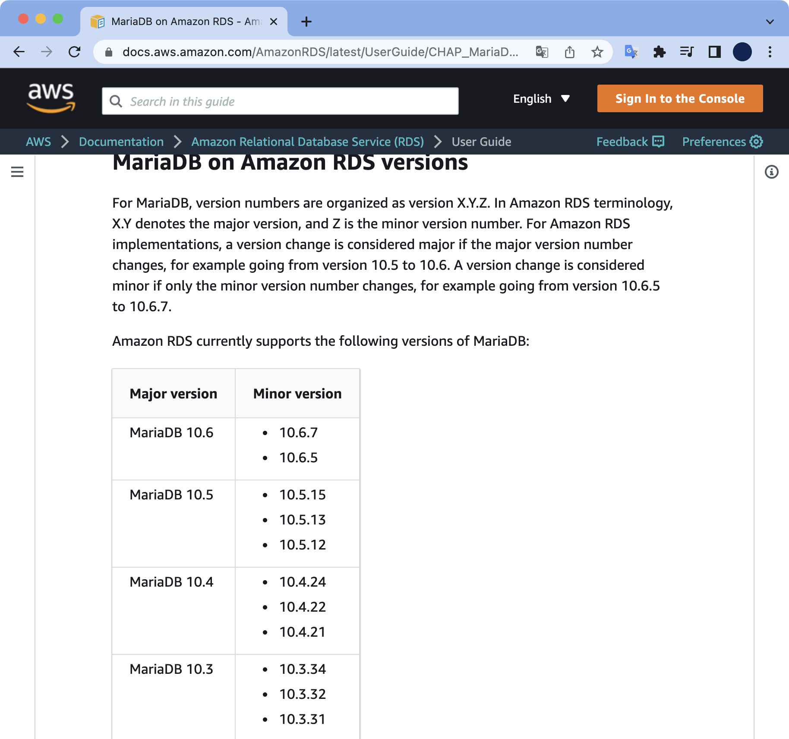

# 12. RDS

## 사전준비

로컬 환경에서 SSH 키 페어를 만들어줍니다.

```bash
$ ssh-keygen -f mykey
Generating public/private rsa key pair.
Enter passphrase (empty for no passphrase):
Enter same passphrase again:
Your identification has been saved in mykey
Your public key has been saved in mykey.pub
The key fingerprint is:
SHA256:mSnruCNqT0T8ZQhBl7H9fnwVwNmDtTxcgrhJ9OI2CPQ steve@steveui-MacBookPro.local
The key's randomart image is:
+---[RSA 3072]----+
|  .+.o+  ....o*..|
|  . oo+.  o..+++o|
|   o o.+E..o.  *.|
|  . . o..*o.    o|
|   . .. S.+    . |
|  .    o....  .  |
|   .  .  . o .   |
| .o .o    . .    |
|o..ooo.          |
+----[SHA256]-----+
```

passphrase는 빈 값으로 주고 생성합니다.

```bash
$ ls mykey*
mykey     mykey.pub
```

비밀키 `mykey`와 공개키 `mykey.pub`가 생성되었습니다.

## init, plan, apply

테라폼을 초기화합니다.

```bash
$ terraform init

Initializing the backend...

Initializing provider plugins...
- Reusing previous version of hashicorp/aws from the dependency lock file
- Using previously-installed hashicorp/aws v4.17.1

Terraform has been successfully initialized!

You may now begin working with Terraform. Try running "terraform plan" to see
any changes that are required for your infrastructure. All Terraform commands
should now work.

If you ever set or change modules or backend configuration for Terraform,
rerun this command to reinitialize your working directory. If you forget, other
commands will detect it and remind you to do so if necessary.
```

플랜을 미리 확인합니다.

```bash
$ terraform plan
...

Plan: 19 to add, 0 to change, 0 to destroy.

Changes to Outputs:
  + instance = (known after apply)
  + rds      = (known after apply)

────────────────────────────────────────────────────────────────────────────

Note: You didn't use the -out option to save this plan, so Terraform can't
guarantee to take exactly these actions if you run "terraform apply" now.
```

19개의 리소스가 생성될 예정입니다.  
생성을 마치고나면 Outputs에는 EC2 Instance IP와 RDS의 Endpoint가 출력될 겁니다.

테라폼으로 생성을 진행합니다.  
`-var` 옵션으로 자신이 원하는 RDS의 Password를 지정할 수 있습니다.

```bash
$ terraform apply -var RDS_PASSWORD=1l0veterraf0rm!
...

Plan: 19 to add, 0 to change, 0 to destroy.

Changes to Outputs:
  + instance = (known after apply)
  + rds      = (known after apply)

Do you want to perform these actions?
  Terraform will perform the actions described above.
  Only 'yes' will be accepted to approve.

  Enter a value: yes
```

중간에 `yes`를 입력해서 생성을 계속 진행합니다.

RDS 생성까지 약 10분 넘게 걸립니다.

```bash
aws_db_instance.mariadb: Creation complete after 9m59s [id=mariadb]

Apply complete! Resources: 19 added, 0 changed, 0 destroyed.

Outputs:

instance = "3.35.166.122"
rds = "mariadb.cqsapqes1t7w.ap-northeast-2.rds.amazonaws.com:3306"
```

EC2 인스턴스에 접속합니다.  
EC2 인스턴스를 통해 RDS에 접속할 수 있습니다.

```bash
$ ssh -i mykey -l ec2-user 3.35.166.122
The authenticity of host '3.35.166.122 (3.35.166.122)' can't be established.
ED25519 key fingerprint is SHA256:y7DzngM+16rzvY+Jq093SfgXbpFU1O4XwBElrlOu+Oc.
This key is not known by any other names
Are you sure you want to continue connecting (yes/no/[fingerprint])? yes
Warning: Permanently added '3.35.166.122' (ED25519) to the list of known hosts.

       __|  __|_  )
       _|  (     /   Amazon Linux 2 AMI
      ___|\___|___|

https://aws.amazon.com/amazon-linux-2/
2 package(s) needed for security, out of 6 available
Run "sudo yum update" to apply all updates.
[ec2-user@ip-10-0-1-213 ~]$
```

DB에 접속할 때 사용하는 `mysql` 명령어가 EC2에 설치되어 있는지 확인합니다.

```bash
$ which mysql
/usr/bin/which: no mysql in (/usr/local/bin:/usr/bin:/usr/local/sbin:/usr/sbin:/home/ec2-user/.local/bin:/home/ec2-user/bin)
```

현재 인스턴스의 운영체제는 Amazon Linux 2입니다.  
Amazon Linux 2에는 `mysql` 명령어가 기본적으로 설치되어 있지 않습니다.  
수동으로 직접 mysql을 EC2에 설치합니다.

```bash
$ sudo yum update -y
$ sudo yum install mysql
Loaded plugins: extras_suggestions, langpacks, priorities, update-motd
Resolving Dependencies
--> Running transaction check
---> Package mariadb.x86_64 1:5.5.68-1.amzn2 will be installed
--> Finished Dependency Resolution

Dependencies Resolved

=============================================================================
 Package       Arch         Version                   Repository        Size
=============================================================================
Installing:
 mariadb       x86_64       1:5.5.68-1.amzn2          amzn2-core       8.8 M

Transaction Summary
=============================================================================
Install  1 Package

Total download size: 8.8 M
Installed size: 49 M
Is this ok [y/d/N]: yes
Downloading packages:
mariadb-5.5.68-1.amzn2.x86_64.rpm                       | 8.8 MB   00:00
Running transaction check
Running transaction test
Transaction test succeeded
Running transaction
  Installing : 1:mariadb-5.5.68-1.amzn2.x86_64                           1/1
  Verifying  : 1:mariadb-5.5.68-1.amzn2.x86_64                           1/1

Installed:
  mariadb.x86_64 1:5.5.68-1.amzn2

Complete!
```

설치가 완료되었습니다.  
mysql 버전을 확인합니다.

```bash
$ mysql --version
mysql  Ver 15.1 Distrib 5.5.68-MariaDB, for Linux (x86_64) using readline 5.1
```

`mysql` 명령어를 이용해 RDS 데이터베이스에 접속합니다.

```bash
$ [ec2-user@ip-10-0-1-213 ~]$ mysql -u root -h mariadb.cqsapqes1t7w.ap-northeast-2.rds.amazonaws.com -p'1l0veterraf0rm!'
Welcome to the MariaDB monitor.  Commands end with ; or \g.
Your MariaDB connection id is 15
Server version: 10.6.7-MariaDB-log managed by https://aws.amazon.com/rds/

Copyright (c) 2000, 2018, Oracle, MariaDB Corporation Ab and others.

Type 'help;' or '\h' for help. Type '\c' to clear the current input statement.

MariaDB [(none)]> 
```

MariaDB에 로그인하게 되면 프롬프트가 바뀝니다.

```bash
Server version: 10.6.7-MariaDB-log managed by https://aws.amazon.com/rds/
```

로그인 과정에 MariaDB 정보가 출력됩니다.  
현재 MariaDB 버전은 10.6.7 입니다. 2022년 6월 기준으로 최신 버전입니다.  



[AWS 공식문서: MariaDB on Amazon RDS versions](https://docs.aws.amazon.com/AmazonRDS/latest/UserGuide/CHAP_MariaDB.html#MariaDB.Concepts.VersionMgmt)

데이터베이스 목록을 조회합니다.

```sql
MariaDB [(none)]> show databases;
+--------------------+
| Database           |
+--------------------+
| information_schema |
| innodb             |
| mariadb            |
| mysql              |
| performance_schema |
| sys                |
+--------------------+
6 rows in set (0.00 sec)

MariaDB [(none)]>
```

MariaDB에서 로그아웃 하려면 `exit` 명령어를 실행합니다.

```bash
MariaDB [(none)]> exit
Bye
```

## destroy

RDS 비용이 나가는 걸 방지하기 위해서 테라폼으로 생성한 모든 리소스를 삭제합니다.

```bash
$ terraform destroy
...

Plan: 0 to add, 0 to change, 19 to destroy.

Changes to Outputs:
  - instance = "3.35.166.122" -> null
  - rds      = "mariadb.cqsapqes1t7w.ap-northeast-2.rds.amazonaws.com:3306" -> null

Do you really want to destroy all resources?
  Terraform will destroy all your managed infrastructure, as shown above.
  There is no undo. Only 'yes' will be accepted to confirm.

  Enter a value: yes
```

중간에 `yes`를 입력해서 삭제를 계속 진행합니다.

```bash
aws_subnet.main-private-2: Destruction complete after 1s
aws_subnet.main-private-1: Destruction complete after 1s
aws_security_group.allow-mariadb: Destruction complete after 1s
aws_security_group.example-instance: Destroying... [id=sg-06d0ebe9ad295baae]
aws_security_group.example-instance: Destruction complete after 1s
aws_vpc.main: Destroying... [id=vpc-073dd5b9e9ef86b89]
aws_vpc.main: Destruction complete after 0s

Destroy complete! Resources: 19 destroyed.
```

모든 리소스가 삭제되었습니다.  
생성 완료까지 10분 걸린 반면 삭제는 금방 끝납니다.
