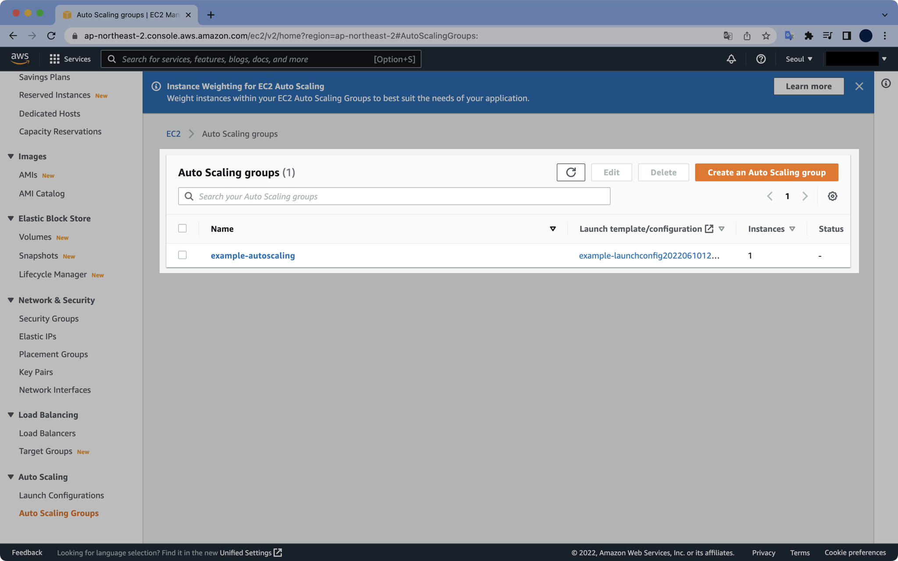
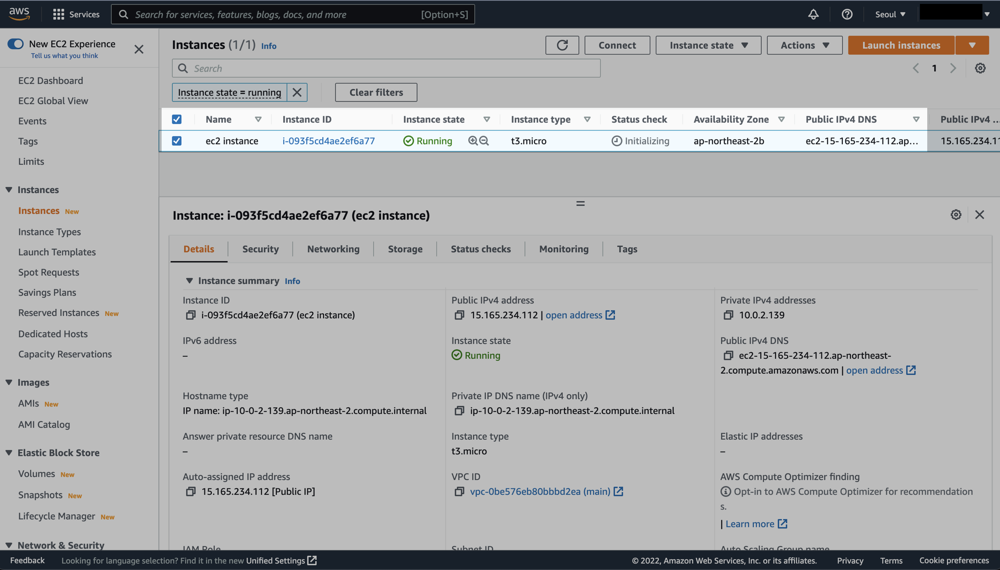
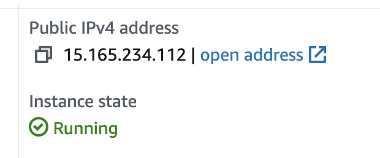
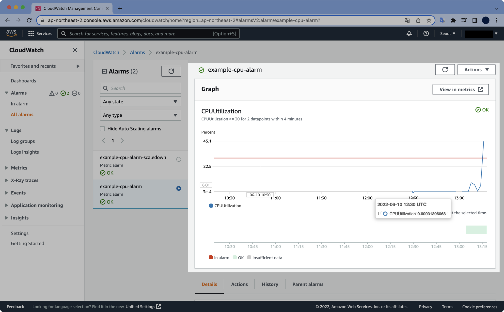
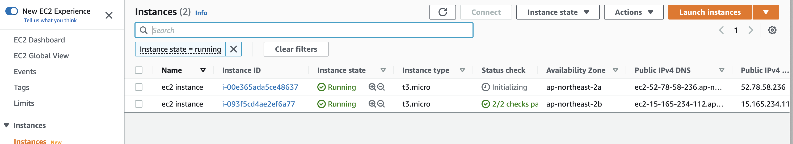
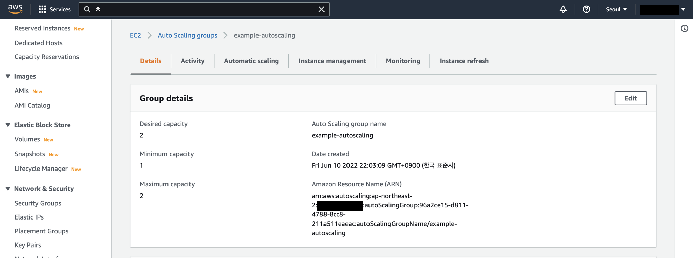
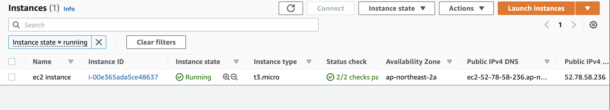

# 15. Auto Scaling Group

## 사전준비

테라폼으로 EC2 키페어가 생성되려면 로컬에서 SSH 키페어를 미리 생성해놓아야 합니다.

로컬에서 SSH 키페어를 생성합니다.

```bash
$ ssh-keygen -f mykey
Generating public/private rsa key pair.
Enter passphrase (empty for no passphrase): 
Enter same passphrase again: 
Your identification has been saved in mykey
Your public key has been saved in mykey.pub
The key fingerprint is:
SHA256:XhiaPHM2NZJKZlGs3qzxpu1oXlqgTXvfjw2dmzegIWM steve@steveui-MacBookPro.local
The key's randomart image is:
+---[RSA 3072]----+
|      .o.        |
|       ...       |
|      +.+ o      |
|     =.+ = .     |
|     .XoS .      |
|     +oOoE . o . |
|    . o+* o + +  |
|      oBo. o + +.|
|     o=+o . o.=..|
+----[SHA256]-----+
```

passphrase는 빈값으로 실행합니다.

```bash
$ ls mykey*
mykey     mykey.pub
```

비밀키인 `mykey`와 공개키인 `mykey.pub`이 새로 생성되었습니다.

## init, plan, apply

테라폼을 초기화합니다.

```bash
$ terraform init

Initializing the backend...

Initializing provider plugins...
- Finding latest version of hashicorp/aws...
- Installing hashicorp/aws v4.18.0...
- Installed hashicorp/aws v4.18.0 (signed by HashiCorp)

Terraform has created a lock file .terraform.lock.hcl to record the provider
selections it made above. Include this file in your version control repository
so that Terraform can guarantee to make the same selections by default when
you run "terraform init" in the future.

Terraform has been successfully initialized!

You may now begin working with Terraform. Try running "terraform plan" to see
any changes that are required for your infrastructure. All Terraform commands
should now work.

If you ever set or change modules or backend configuration for Terraform,
rerun this command to reinitialize your working directory. If you forget, other
commands will detect it and remind you to do so if necessary.
```

플랜을 미리 확인합니다.

```bash
$ terraform plan
...

Plan: 20 to add, 0 to change, 0 to destroy.

─────────────────────────────────────────────────────────────────────────────────────────────────────────────────────────────────────────────────────────────────────────────────────────────────────────────────────

Note: You didn't use the -out option to save this plan, so Terraform can't guarantee to take exactly these actions if you run "terraform apply" now.
```

20개의 리소스가 생성될 예정입니다.

테라폼 코드를 적용합니다.

```bash
$ terraform apply
...

Plan: 20 to add, 0 to change, 0 to destroy.

Do you want to perform these actions?
  Terraform will perform the actions described above.
  Only 'yes' will be accepted to approve.

  Enter a value: yes
```

중간에 `yes`를 눌러서 계속 진행합니다.

```bash
aws_autoscaling_policy.example-cpu-policy-scaledown: Creation complete after 0s [id=example-cpu-policy-scaledown]
aws_cloudwatch_metric_alarm.example-cpu-alarm-scaledown: Creating...
aws_autoscaling_policy.example-cpu-policy: Creation complete after 1s [id=example-cpu-policy]
aws_cloudwatch_metric_alarm.example-cpu-alarm: Creating...
aws_cloudwatch_metric_alarm.example-cpu-alarm: Creation complete after 0s [id=example-cpu-alarm]
aws_cloudwatch_metric_alarm.example-cpu-alarm-scaledown: Creation complete after 0s [id=example-cpu-alarm-scaledown]

Apply complete! Resources: 20 added, 0 changed, 0 destroyed.
```

20개의 리소스가 생성되었습니다.



새로 생성된 Auto Scaling Group을 확인합니다.



Auto Scaling Group으로 인해 EC2 1대가 생성되었습니다.



AWS 콘솔에서 EC2의 Public IP를 확인합니다.

이제 EC2에 부하를 유발해서 직접 오토스케일링을 발생시켜보도록 테스트하겠습니다.

이전에 생성한 SSH 키를 이용해서 EC2에 SSH로 접속합니다.

접속할 IP는 Public IP(공인 IP)로 해야합니다.

```bash
$ ssh -i mykey -l ec2-user 15.165.234.112
The authenticity of host '15.165.234.112 (15.165.234.112)' can't be established.
ED25519 key fingerprint is SHA256:6AIchAOUJOARfAgCa9vvUwTmNX8hOKLcfPECAS595MY.
This key is not known by any other names
Are you sure you want to continue connecting (yes/no/[fingerprint])? yes
```

`yes`를 입력해 로그인합니다.

```bash
Warning: Permanently added '15.165.234.112' (ED25519) to the list of known hosts.

       __|  __|_  )
       _|  (     /   Amazon Linux 2 AMI
      ___|\___|___|

https://aws.amazon.com/amazon-linux-2/
16 package(s) needed for security, out of 26 available
Run "sudo yum update" to apply all updates.
[ec2-user@ip-10-0-2-139 ~]$
```

부하를 유발하는 소프트웨어 도구인 stress를 설치해보겠습니다.  
현재 AMI의 운영체제는 Amazon Linux 2입니다.

```bash
$ sudo amazon-linux-extras install epel -y
$ sudo yum install stress -y
```

stress 패키지를 설치했으면 CPU 부하를 유발합니다.

```bash
$ stress --version
stress 1.0.4
$ stress --cpu 2 --timeout 300
```

`--timeout` 옵션을 사용해서 300초 후 자동으로 부하유발이 종료되도록 설정했습니다.

CloudWatch 페이지에서 오토스케일링 그룹의 CPU Alarm을 확인할 수 있습니다.



잠시 기다리면 EC2가 2대로 늘어나는 걸 확인할 수 있습니다.



Auto Scaling Group 페이지에서 Desired Capacity가 1에서 2로 늘어난 걸 확인할 수 있습니다.



EC2에 접속되어 있는 터미널로 돌아옵니다.  

```bash
$ stress --cpu 2 --timeout 300
stress: info: [9197] dispatching hogs: 2 cpu, 0 io, 0 vm, 0 hdd
stress: info: [9197] successful run completed in 300s
```

stress의 부하 테스트는 저희가 설정한대로 300초가 지난 후 자동 종료된 걸 확인할 수 있습니다.

이후 잠시 시간이 지난 후 EC2 인스턴스를 다시 확인해보면 2대에서 1대로 줄어들어 있습니다.



Auto Scaling Group의 Minimum Capacity 값이 1로 설정되어 있기 때문에, EC2가 모두 삭제되지는 않는다는 점 명심하세요.

## destroy

실습이 종료되면 반드시 생성한 리소스 모두를 삭제해야 합니다.

```bash
$ terraform destroy
...

Plan: 0 to add, 0 to change, 20 to destroy.

Do you really want to destroy all resources?
  Terraform will destroy all your managed infrastructure, as shown above.
  There is no undo. Only 'yes' will be accepted to confirm.

  Enter a value: yes
```

`yes`를 입력해서 삭제를 계속 진행합니다.

```bash
aws_key_pair.mykeypair: Destroying... [id=mykeypair]
aws_security_group.allow-ssh: Destroying... [id=sg-06d297a0d90c09944]
aws_key_pair.mykeypair: Destruction complete after 0s
aws_subnet.main-public-1: Destruction complete after 0s
aws_subnet.main-public-2: Destruction complete after 0s
aws_security_group.allow-ssh: Destruction complete after 1s
aws_vpc.main: Destroying... [id=vpc-0be576eb80bbbd2ea]
aws_vpc.main: Destruction complete after 0s

Destroy complete! Resources: 20 destroyed.
```

20개의 리소스가 삭제되었습니다.
