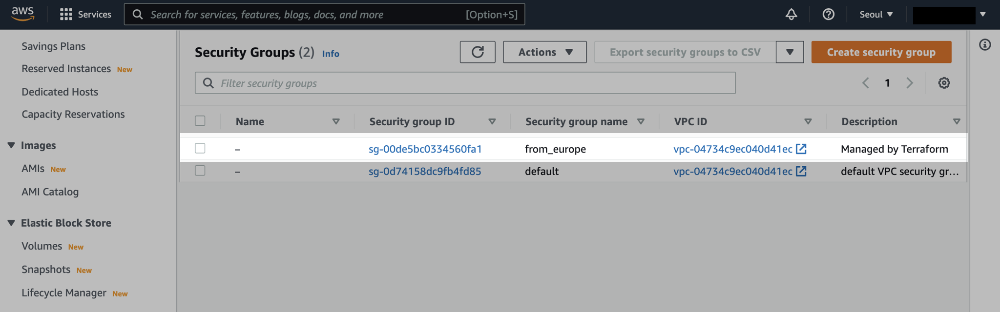
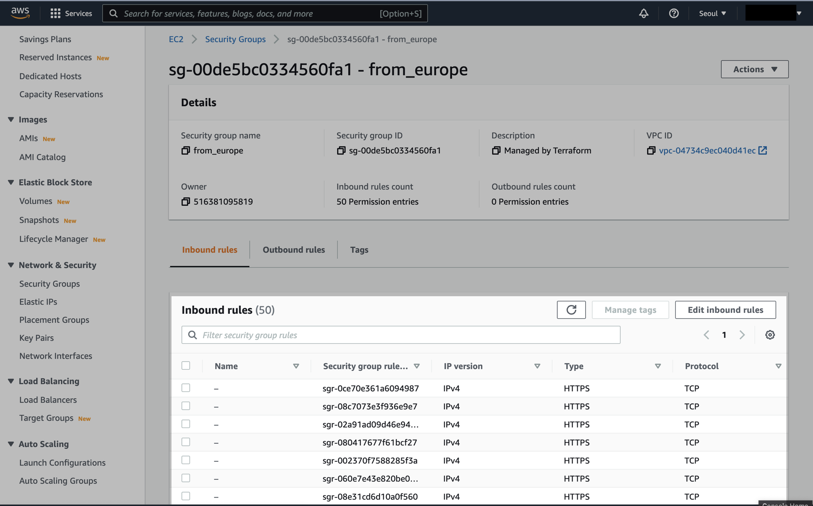

# 4. Data Sources

## init, plan, apply

```bash
terraform init

Initializing the backend...

Initializing provider plugins...
- Finding latest version of hashicorp/aws...
- Installing hashicorp/aws v4.17.1...
- Installed hashicorp/aws v4.17.1 (signed by HashiCorp)

Terraform has created a lock file .terraform.lock.hcl to record the provider
selections it made above. Include this file in your version control repository
so that Terraform can guarantee to make the same selections by default when
you run "terraform init" in the future.

Terraform has been successfully initialized!

You may now begin working with Terraform. Try running "terraform plan" to see
any changes that are required for your infrastructure. All Terraform commands
should now work.

If you ever set or change modules or backend configuration for Terraform,
rerun this command to reinitialize your working directory. If you forget, other
commands will detect it and remind you to do so if necessary.
```

```bash
$ terraform plan
data.aws_ip_ranges.european_ec2: Reading...
data.aws_ip_ranges.european_ec2: Read complete after 0s [id=1654474985]

Terraform used the selected providers to generate the following execution plan. Resource
actions are indicated with the following symbols:
  + create

Terraform will perform the following actions:

  # aws_security_group.from_europe will be created
  + resource "aws_security_group" "from_europe" {
      + arn                    = (known after apply)
      + description            = "Managed by Terraform"
      + egress                 = (known after apply)
      + id                     = (known after apply)
      + ingress                = [
          + {
              + cidr_blocks      = [
                  + "108.128.0.0/13",
                  + "15.177.68.0/23",
                  + "15.177.75.0/24",
                  + "15.177.89.0/24",
                  + "15.193.4.0/24",
                  + "162.213.232.0/24",
                  + "162.213.233.0/24",
                  + "162.213.234.0/23",
                  + "176.34.128.0/17",
                  + "176.34.64.0/18",
                  + "18.153.0.0/16",
                  + "18.156.0.0/14",
                  + "18.184.0.0/15",
                  + "18.192.0.0/15",
                  + "18.194.0.0/15",
                  + "18.196.0.0/15",
                  + "18.198.0.0/15",
                  + "18.200.0.0/16",
                  + "18.201.0.0/16",
                  + "18.202.0.0/15",
                  + "18.34.240.0/22",
                  + "18.34.32.0/20",
                  + "185.48.120.0/22",
                  + "195.17.0.0/24",
                  + "208.86.90.0/23",
                  + "3.120.0.0/14",
                  + "3.124.0.0/14",
                  + "3.248.0.0/13",
                  + "3.33.35.0/24",
                  + "3.5.134.0/23",
                  + "3.5.136.0/22",
                  + "3.5.64.0/21",
                  + "3.5.72.0/23",
                  + "3.64.0.0/12",
                  + "34.240.0.0/13",
                  + "34.248.0.0/13",
                  + "35.156.0.0/14",
                  + "35.71.105.0/24",
                  + "35.71.72.0/22",
                  + "46.137.0.0/17",
                  + "46.137.128.0/18",
                  + "46.51.128.0/18",
                  + "46.51.192.0/20",
                  + "52.16.0.0/15",
                  + "52.18.0.0/15",
                  + "52.208.0.0/13",
                  + "52.28.0.0/16",
                  + "52.29.0.0/16",
                  + "52.30.0.0/15",
                  + "52.46.184.0/22",
                ]
              + description      = ""
              + from_port        = 443
              + ipv6_cidr_blocks = []
              + prefix_list_ids  = []
              + protocol         = "tcp"
              + security_groups  = []
              + self             = false
              + to_port          = 443
            },
        ]
      + name                   = "from_europe"
      + name_prefix            = (known after apply)
      + owner_id               = (known after apply)
      + revoke_rules_on_delete = false
      + tags                   = {
          + "CreateDate" = "2022-06-06-00-23-05"
          + "SyncToken"  = "1654474985"
        }
      + tags_all               = {
          + "CreateDate" = "2022-06-06-00-23-05"
          + "SyncToken"  = "1654474985"
        }
      + vpc_id                 = (known after apply)
    }

Plan: 1 to add, 0 to change, 0 to destroy.

──────────────────────────────────────────────────────────────────────────────────────────────

Note: You didn't use the -out option to save this plan, so Terraform can't guarantee to take
exactly these actions if you run "terraform apply" now.

```

```bash
$ terraform apply
data.aws_ip_ranges.european_ec2: Reading...
data.aws_ip_ranges.european_ec2: Read complete after 1s [id=1654474985]

Terraform used the selected providers to generate the following execution plan. Resource
actions are indicated with the following symbols:
  + create

Terraform will perform the following actions:

  # aws_security_group.from_europe will be created
  + resource "aws_security_group" "from_europe" {
      + arn                    = (known after apply)
      + description            = "Managed by Terraform"
      + egress                 = (known after apply)
      + id                     = (known after apply)
      + ingress                = [
          + {
              + cidr_blocks      = [
                  + "108.128.0.0/13",
                  + "15.177.68.0/23",
                  + "15.177.75.0/24",
                  + "15.177.89.0/24",
                  + "15.193.4.0/24",
                  + "162.213.232.0/24",
                  + "162.213.233.0/24",
                  + "162.213.234.0/23",
                  + "176.34.128.0/17",
                  + "176.34.64.0/18",
                  + "18.153.0.0/16",
                  + "18.156.0.0/14",
                  + "18.184.0.0/15",
                  + "18.192.0.0/15",
                  + "18.194.0.0/15",
                  + "18.196.0.0/15",
                  + "18.198.0.0/15",
                  + "18.200.0.0/16",
                  + "18.201.0.0/16",
                  + "18.202.0.0/15",
                  + "18.34.240.0/22",
                  + "18.34.32.0/20",
                  + "185.48.120.0/22",
                  + "195.17.0.0/24",
                  + "208.86.90.0/23",
                  + "3.120.0.0/14",
                  + "3.124.0.0/14",
                  + "3.248.0.0/13",
                  + "3.33.35.0/24",
                  + "3.5.134.0/23",
                  + "3.5.136.0/22",
                  + "3.5.64.0/21",
                  + "3.5.72.0/23",
                  + "3.64.0.0/12",
                  + "34.240.0.0/13",
                  + "34.248.0.0/13",
                  + "35.156.0.0/14",
                  + "35.71.105.0/24",
                  + "35.71.72.0/22",
                  + "46.137.0.0/17",
                  + "46.137.128.0/18",
                  + "46.51.128.0/18",
                  + "46.51.192.0/20",
                  + "52.16.0.0/15",
                  + "52.18.0.0/15",
                  + "52.208.0.0/13",
                  + "52.28.0.0/16",
                  + "52.29.0.0/16",
                  + "52.30.0.0/15",
                  + "52.46.184.0/22",
                ]
              + description      = ""
              + from_port        = 443
              + ipv6_cidr_blocks = []
              + prefix_list_ids  = []
              + protocol         = "tcp"
              + security_groups  = []
              + self             = false
              + to_port          = 443
            },
        ]
      + name                   = "from_europe"
      + name_prefix            = (known after apply)
      + owner_id               = (known after apply)
      + revoke_rules_on_delete = false
      + tags                   = {
          + "CreateDate" = "2022-06-06-00-23-05"
          + "SyncToken"  = "1654474985"
        }
      + tags_all               = {
          + "CreateDate" = "2022-06-06-00-23-05"
          + "SyncToken"  = "1654474985"
        }
      + vpc_id                 = (known after apply)
    }

Plan: 1 to add, 0 to change, 0 to destroy.

Do you want to perform these actions?
  Terraform will perform the actions described above.
  Only 'yes' will be accepted to approve.

  Enter a value: yes

aws_security_group.from_europe: Creating...
aws_security_group.from_europe: Creation complete after 1s [id=sg-00de5bc0334560fa1]

Apply complete! Resources: 1 added, 0 changed, 0 destroyed.
```

AWS Management Console로 돌아옵니다.

새로 생성된 보안그룹의 상세정보를 확인합니다.





테라폼 데이터 소스로 받아온 IP 대역 정보가 Security Group의 인바운드 룰로 들어간 걸 확인할 수 있습니다.
