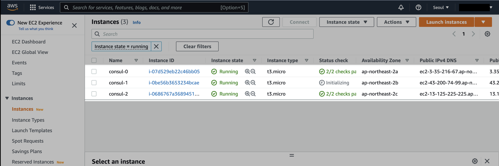
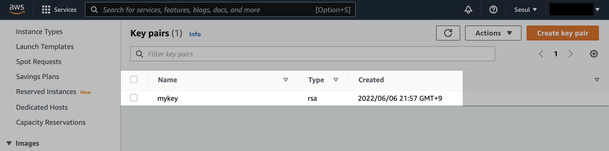

# 5. Module

## 코드 다운로드

[](./code/)

## 환경구성

```bash
$ ls
default_vpc.tf modules.tf     variables.tf
key.tf         provider.tf    versions.tf
```

```bash
$ cat key.tf
resource "aws_key_pair" "mykey" {
  key_name   = "mykey"
  public_key = file(var.PATH_TO_PUBLIC_KEY)
}
```

로컬에 생성한 SSH 키 페어를 기반으로 AWS EC2 Key Pair를 생성하는 코드입니다.  
테라폼으로 EC2 Key Pair를 생성하려면 먼저 로컬에서 SSH Key를 생성해야 합니다.

```
$ ssh-keygen -f mykey
Generating public/private rsa key pair.
Enter passphrase (empty for no passphrase):
Enter same passphrase again:
Your identification has been saved in mykey
Your public key has been saved in mykey.pub
The key fingerprint is:
SHA256:NFWhDQyveNn3Ig7KBMCNMWrQHx4+i7J4b2Rnr+ivM10 steve@steveui-MacBookPro.local
The key's randomart image is:
+---[RSA 3072]----+
|..o     .oo.o.   |
|.o.=o    o.+     |
|..++.o  o o .    |
|.  .=  o =       |
|   ..o. S . .    |
|. . +.o.E  . .   |
|.o o +.o. . . .  |
|o . ++...o . .   |
| . +===.  .      |
+----[SHA256]-----+
```

중간에 passphrase 값은 아무것도 입력하지 않습니다.

```bash
$ ls | grep mykey
mykey
mykey.pub
```

비밀키 `mykey`와 공개키 `mykey.pub` 파일이 생성된 걸 확인할 수 있습니다.

## init, plan, apply

```bash
$ terraform init
Initializing modules...
Downloading git::https://github.com/wardviaene/terraform-consul-module.git?ref=terraform-0.12 for consul...
- consul in .terraform/modules/consul

Initializing the backend...

Initializing provider plugins...
- Finding latest version of hashicorp/aws...
- Installing hashicorp/aws v4.17.1...
- Installed hashicorp/aws v4.17.1 (signed by HashiCorp)

Terraform has created a lock file .terraform.lock.hcl to record the provider
selections it made above. Include this file in your version control repository
so that Terraform can guarantee to make the same selections by default when
you run "terraform init" in the future.

Terraform has been successfully initialized!

You may now begin working with Terraform. Try running "terraform plan" to see
any changes that are required for your infrastructure. All Terraform commands
should now work.

If you ever set or change modules or backend configuration for Terraform,
rerun this command to reinitialize your working directory. If you forget, other
commands will detect it and remind you to do so if necessary.
```

Plan으로 미리 확인합니다.

```bash
$ terraform plan
  # module.consul.aws_instance.server[0] will be created
  ...
      + instance_type                        = "t3.micro"

  # module.consul.aws_instance.server[1] will be created
  ...
      + instance_type                        = "t3.micro"

  # module.consul.aws_instance.server[2] will be created
  ...
      + instance_type                        = "t3.micro"

Plan: 9 to add, 0 to change, 0 to destroy.

Changes to Outputs:
  + consul-output = (known after apply)

──────────────────────────────────────────────────────────────────────

Note: You didn't use the -out option to save this plan, so Terraform
can't guarantee to take exactly these actions if you run "terraform
apply" now.
```

3대의 t3.micro로 구성된 Consul Cluster가 만들어질 예정입니다.

참고로 인스턴스 타입을 `t2.micro`로 생성하면 `t2.micro`가 서울 리전의 전체 가용 영역을 지원하지 않는 인스턴스 타입이기 때문에 apply 할 때 아래와 같은 에러가 발생합니다.

```bash
...
module.consul.aws_instance.server[2]: Creation complete after 1m25s [id=i-03cc260bf651056ca]
╷
│ Error: creating EC2 Instance: Unsupported: Your requested instance type (t2.micro) is not supported in your requested Availability Zone (ap-northeast-2b). Please retry your request by not specifying an Availability Zone or choosing ap-northeast-2a, ap-northeast-2c.
│ 	status code: 400, request id: 3bcebb84-95e9-4ccf-9834-1b9dc3443077
│
│   with module.consul.aws_instance.server[1],
│   on .terraform/modules/consul/consul.tf line 1, in resource "aws_instance" "server":
│    1: resource "aws_instance" "server" {
│
╵
```

이러한 문제를 방지하기 위해 모든 가용영역에 지원되는 `t3.micro`로 생성하겠습니다.

Apply 합니다.

```bash
$ terraform apply
...

Plan: 9 to add, 0 to change, 0 to destroy.

Changes to Outputs:
  + consul-output = (known after apply)

Do you want to perform these actions?
  Terraform will perform the actions described above.
  Only 'yes' will be accepted to approve.

  Enter a value: yes

```

첫 번째 서버가 생성된 후, 나머지 2대의 서버를 Consul 클러스터에 자동적으로 추가하는 과정을 볼 수 있습니다.  
중간에 각 서버마다 SSH 접속도 잘 되는지 체크해주는 과정도 포함되어 있습니다.

```bash
...
module.consul.aws_instance.server[2] (remote-exec): Connecting to remote host via SSH...
module.consul.aws_instance.server[2] (remote-exec):   Host: 13.125.225.225
module.consul.aws_instance.server[2] (remote-exec):   User: ubuntu
module.consul.aws_instance.server[2] (remote-exec):   Password: false
module.consul.aws_instance.server[2] (remote-exec):   Private key: true
module.consul.aws_instance.server[2] (remote-exec):   Certificate: false
module.consul.aws_instance.server[2] (remote-exec):   SSH Agent: true
module.consul.aws_instance.server[2] (remote-exec):   Checking Host Key: false
module.consul.aws_instance.server[2] (remote-exec):   Target Platform: unix
module.consul.aws_instance.server[2] (remote-exec): Connected!
module.consul.aws_instance.server[2] (remote-exec): Installing dependencies...
...
```

```bash
Apply complete! Resources: 9 added, 0 changed, 0 destroyed.

Outputs:

consul-output = "ec2-3-35-216-67.ap-northeast-2.compute.amazonaws.com"
```

AWS Management Console로 이동해서 EC2 인스턴스 목록을 확인해봅니다.



Consul 클러스터 인스턴스 3대가 생성되었습니다.

SSH를 통해 인스턴스에 접속해서 확인해볼 수도 있지만, 테라폼 코스의 범위를 벗어나는 부분이라 스킵하도록 하겠습니다.  
궁금하신 분들은 직접 접속 시도 해보셔도 됩니다.



SSH 키페어도 잘 생성된 걸 확인할 수 있습니다.  
현재 콘솔에서 보이는 `mykey`는 로컬에서 직접 생성한 SSH의 키 값을 기반으로 AWS에 업로드 된거라고 이해하면 됩니다.


`t3.micro` 타입의 인스턴스 3대 비용이 나가는 걸 방지하기 위해서 실습이 끝난 즉시 삭제해줍시다.

```bash
$ terraform destroy
...

Plan: 0 to add, 0 to change, 9 to destroy.

Changes to Outputs:
  - consul-output = "ec2-3-35-216-67.ap-northeast-2.compute.amazonaws.com" -> null

Do you really want to destroy all resources?
  Terraform will destroy all your managed infrastructure, as shown above.
  There is no undo. Only 'yes' will be accepted to confirm.

  Enter a value: yes
```

```bash
module.consul.aws_instance.server[0]: Destroying... [id=i-07d529eb22c46bb05]
module.consul.aws_instance.server[1]: Destroying... [id=i-0be56b3653234bcae]
module.consul.aws_instance.server[2]: Destroying... [id=i-0686767a368945194]
module.consul.aws_instance.server[2]: Still destroying... [id=i-0686767a368945194, 10s elapsed]
module.consul.aws_instance.server[0]: Still destroying... [id=i-07d529eb22c46bb05, 10s elapsed]
module.consul.aws_instance.server[1]: Still destroying... [id=i-0be56b3653234bcae, 10s elapsed]
module.consul.aws_instance.server[0]: Still destroying... [id=i-07d529eb22c46bb05, 20s elapsed]
module.consul.aws_instance.server[2]: Still destroying... [id=i-0686767a368945194, 20s elapsed]
module.consul.aws_instance.server[1]: Still destroying... [id=i-0be56b3653234bcae, 20s elapsed]
module.consul.aws_instance.server[1]: Destruction complete after 30s
module.consul.aws_instance.server[2]: Still destroying... [id=i-0686767a368945194, 30s elapsed]
module.consul.aws_instance.server[0]: Still destroying... [id=i-07d529eb22c46bb05, 30s elapsed]
module.consul.aws_instance.server[0]: Destruction complete after 40s
module.consul.aws_instance.server[2]: Still destroying... [id=i-0686767a368945194, 40s elapsed]
module.consul.aws_instance.server[2]: Still destroying... [id=i-0686767a368945194, 50s elapsed]
module.consul.aws_instance.server[2]: Still destroying... [id=i-0686767a368945194, 1m0s elapsed]
module.consul.aws_instance.server[2]: Destruction complete after 1m0s
aws_default_subnet.default_az1: Destroying... [id=subnet-004a27c6ea5cbceb9]
aws_default_subnet.default_az2: Destroying... [id=subnet-0f56d04f416dfa75c]
aws_key_pair.mykey: Destroying... [id=mykey]
module.consul.aws_security_group.consul: Destroying... [id=sg-0fc1a0fabb37db5f8]
aws_default_subnet.default_az3: Destroying... [id=subnet-020c7d01e3817d969]
aws_default_subnet.default_az3: Destruction complete after 0s
aws_default_subnet.default_az2: Destruction complete after 0s
aws_default_subnet.default_az1: Destruction complete after 0s
aws_key_pair.mykey: Destruction complete after 0s
module.consul.aws_security_group.consul: Destruction complete after 1s
aws_default_vpc.default: Destroying... [id=vpc-04734c9ec040d41ec]
aws_default_vpc.default: Destruction complete after 0s

Destroy complete! Resources: 9 destroyed.
```

테라폼으로 생성한 모든 리소스가 삭제 완료되었습니다.
