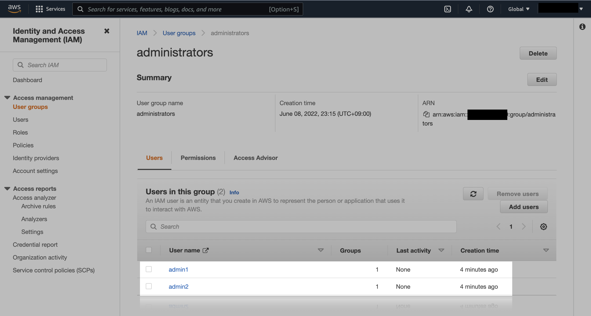

# 13. IAM User Group

## init, plan, apply

```bash
$ ls
iam.tf       provider.tf  variables.tf versions.tf
```

```bash
$ terraform init

Initializing the backend...

Initializing provider plugins...
- Finding latest version of hashicorp/aws...
- Installing hashicorp/aws v4.17.1...
- Installed hashicorp/aws v4.17.1 (signed by HashiCorp)

Terraform has created a lock file .terraform.lock.hcl to record the provider
selections it made above. Include this file in your version control repository
so that Terraform can guarantee to make the same selections by default when
you run "terraform init" in the future.

Terraform has been successfully initialized!

You may now begin working with Terraform. Try running "terraform plan" to see
any changes that are required for your infrastructure. All Terraform commands
should now work.

If you ever set or change modules or backend configuration for Terraform,
rerun this command to reinitialize your working directory. If you forget, other
commands will detect it and remind you to do so if necessary.
```

```bash
$ terraform plan
...

Plan: 5 to add, 0 to change, 0 to destroy.

Changes to Outputs:
  + warning = "WARNING: make sure you're not using the AdministratorAccess policy for other users/groups/roles. If this is the case, don't run terraform destroy, but manually unlink the created resources"
```

5개의 리소스가 만들어질 예정입니다.

```bash
$ terraform apply
```

유저 그룹과 유저가 생성되었고, 그룹에 추가된 걸 확인할 수 있습니다.



IAM User의 패스워드 설정은 콘솔이나 AWS CLI로 직접 설정해야 합니다.  
테라폼 상태파일이나 코드에 비밀번호가 노출시킬 수는 없기 때문입니다.

## destroy

실습이 끝난 후 리소스를 정리합니다.

```bash
$ terraform destroy
```
