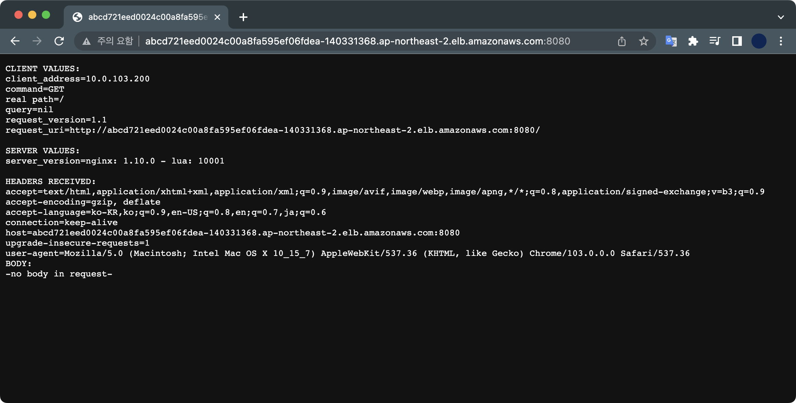

# 21. EKS

## 코드 다운로드

[Terraform Code](./code/)

## 사전준비

- 쿠버네티스 CLI 관리툴인 `kubectl`이 설치되어 있어야 합니다.
- AWS CLI에 충분한 권한이 설정되어 있어야 합니다.

현재 제 실습환경에서는 `kubectl` v1.24.2를 사용합니다.

```bash
$ kubectl version
WARNING: This version information is deprecated and will be replaced with the output from kubectl version --short.  Use --output=yaml|json to get the full version.
Client Version: version.Info{Major:"1", Minor:"24", GitVersion:"v1.24.2", GitCommit:"f66044f4361b9f1f96f0053dd46cb7dce5e990a8", GitTreeState:"clean", BuildDate:"2022-06-15T14:14:10Z", GoVersion:"go1.18.3", Compiler:"gc", Platform:"darwin/arm64"}
Kustomize Version: v4.5.4
Server Version: version.Info{Major:"1", Minor:"22+", GitVersion:"v1.22.9-eks-a64ea69", GitCommit:"540410f9a2e24b7a2a870ebfacb3212744b5f878", GitTreeState:"clean", BuildDate:"2022-05-12T19:15:31Z", GoVersion:"go1.16.15", Compiler:"gc", Platform:"linux/amd64"}
WARNING: version difference between client (1.24) and server (1.22) exceeds the supported minor version skew of +/-1
```

&nbsp;

## init, plan, apply

테라폼 초기화와 플랜을 실행합니다.

```bash
$ terraform init
$ terraform plan
```

플랜을 확인한 후에는 리소스를 생성합니다.

```bash
$ terraform apply
...
Apply complete! Resources: 37 added, 0 changed, 0 destroyed.

Outputs:
...
```

쿠버네티스 클러스터 생성할 때는 시간이 좀 걸립니다.  
37개의 리소스 생성에는 약 10분 정도 소요됩니다.

## 클러스터 접속하기

### Context 추가

쿠버네티스 클러스터에 접근하려면 `.kube/config` 파일에 Context를 추가해야 합니다.

AWS CLI로 쉽게 설정파일에 자동 추가할 수 있습니다.

```bash
$ aws eks update-kubeconfig \
 --region ap-northeast-2 \
 --name terraform-eks-demo
Added new context arn:aws:eks:ap-northeast-2:123456789012:cluster/terraform-eks-demo to /Users/steve/.kube/config
```

새 Cluster Context가 추가되었습니다.

전체 Context 목록을 확인합니다.

```bash
$ kubectl config get-contexts
CURRENT   NAME                                                                 CLUSTER                                                              AUTHINFO                                                             NAMESPACE
*         arn:aws:eks:ap-northeast-2:123456789012:cluster/terraform-eks-demo   arn:aws:eks:ap-northeast-2:123456789012:cluster/terraform-eks-demo   arn:aws:eks:ap-northeast-2:123456789012:cluster/terraform-eks-demo
```

### aws-auth ConfigMap 추가

쿠버네티스 노드에 접근하기 위해 aws-auth Config Map을 클러스터에 생성합니다.  
ConfigMap의 내용은 이미 terraform의 output에 있습니다.

```bash
$ terraform output config-map-aws-auth >> ./config-map-aws-auth.yaml
```

```bash
$ kubectl apply -f config-map-aws-auth.yaml
configmap/aws-auth created
```

ConfigMap을 추가한 후 노드의 상태를 확인합니다.

```bash
$ kubectl get node
NAME                                              STATUS     ROLES    AGE   VERSION
ip-10-0-101-67.ap-northeast-2.compute.internal    NotReady   <none>   17s   v1.22.9-eks-810597c
ip-10-0-103-200.ap-northeast-2.compute.internal   NotReady   <none>   17s   v1.22.9-eks-810597c
```

현재 데모 클러스터는 2대의 노드로 구성됩니다. 아직 초기화 상태이기 때문에 노드의 상태가 `NotReady` 입니다.

잠시 후 다시 노드 상태를 조회합니다.

```bash
$ kubectl get node
NAME                                              STATUS   ROLES    AGE   VERSION
ip-10-0-101-67.ap-northeast-2.compute.internal    Ready    <none>   28m   v1.22.9-eks-810597c
ip-10-0-103-200.ap-northeast-2.compute.internal   Ready    <none>   28m   v1.22.9-eks-810597c
```

`Ready`인 걸 확인할 수 있습니다.

&nbsp;

## 데모

echoserver 파드를 생성합니다.

```bash
$ kubectl run helloworld --image=k8s.gcr.io/echoserver:1.4 --port=8080
pod/helloworld created
```

파드가 생성되었습니다.

```bash
$ kubectl get pod
NAME         READY   STATUS    RESTARTS   AGE
helloworld   1/1     Running   0          17m
```

이제 생성한 파드를 외부로 노출시키기 위해 echoserver 서비스를 생성합니다.

```bash
$ kubectl get service                              
NAME         TYPE           CLUSTER-IP      EXTERNAL-IP                                                                   PORT(S)          AGE
helloworld   LoadBalancer   172.20.241.12   abcd721eed0024c00a8fa595ef06fdea-140331368.ap-northeast-2.elb.amazonaws.com   8080:31420/TCP   6s
kubernetes   ClusterIP      172.20.0.1      <none>                                                                        443/TCP          17m
```

이후 웹 브라우저를 열어서 EXTERNAL-IP의 8080 포트로 접근합니다.  
제 경우 `abcd721eed0024c00a8fa595ef06fdea-140331368.ap-northeast-2.elb.amazonaws.com:8080`이 접속할 주소가 됩니다.



로드밸런서 서비스를 통해 echoserver 파드에 접속한 걸 확인할 수 있습니다.

&nbsp;

## destroy

EKS 클러스터 비용과 EC2 2대에 대한 비용이 은근히 비싸기 때문에 실습이 끝나면 반드시 리소스를 삭제합니다.

```bash
$ terraform destroy
...

Plan: 0 to add, 0 to change, 37 to destroy.
...
```

삭제 과정에서 VPC 종속성 문제로 EKS용 VPC 리소스가 삭제되지 않는 문제가 발생할 수도 있습니다.  
그럴 경우 [AWS 공식문서](https://aws.amazon.com/ko/premiumsupport/knowledge-center/troubleshoot-dependency-error-delete-vpc/)를 참조해서 해결해야 합니다.

&nbsp;

## context 정리

등록했던 Cluster Context를 삭제합니다.

```bash
$ kubectl config delete-context arn:aws:eks:ap-northeast-2:123456789012:cluster/terraform-eks-demo
warning: this removed your active context, use "kubectl config use-context" to select a different one
deleted context arn:aws:eks:ap-northeast-2:123456789012:cluster/terraform-eks-demo from /Users/steve/.kube/config
```

전체 Context 목록을 확인합니다.

```bash
$ kubectl config get-contexts
CURRENT   NAME   CLUSTER   AUTHINFO   NAMESPACE
```

삭제했기 때문에 조회되지 않는 걸 확인할 수 있습니다.
