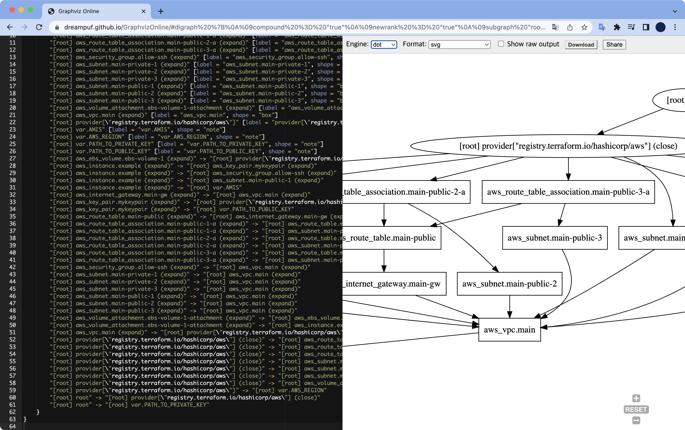
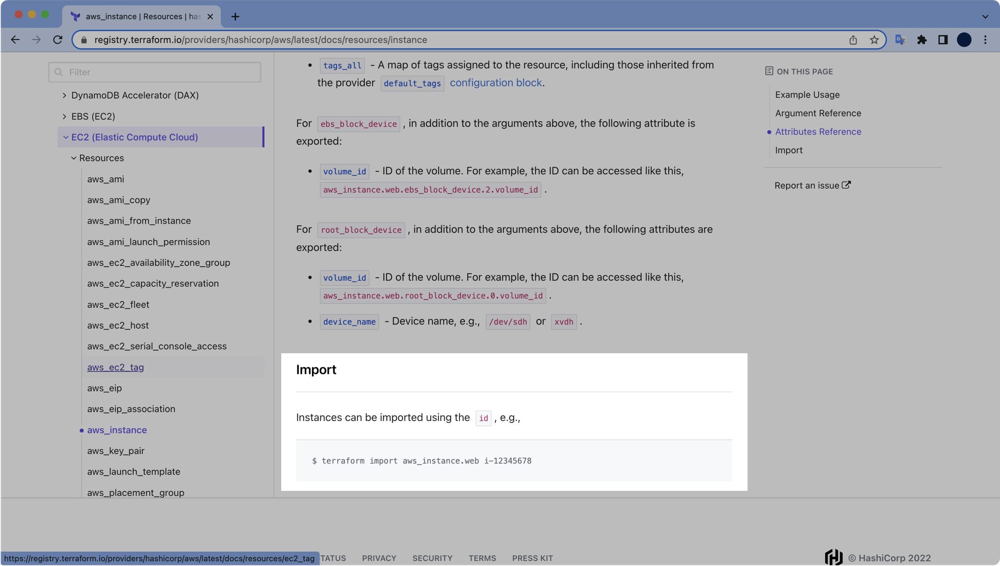

# 6. Terraform 명령어

## 사전준비

EC2 Key Pair를 테라폼으로 생성하려면 로컬 SSH Key 페어가 필요합니다.

로컬에서 SSH 키 페어를 먼저 생성합니다.

```bash
$ ls
instance.tf      provider.tf      variables.tf     vpc.tf
key.tf           securitygroup.tf versions.tf
```

```bash
$ ssh-keygen -f mykey
Generating public/private rsa key pair.
Enter passphrase (empty for no passphrase):
Enter same passphrase again:
Your identification has been saved in mykey
Your public key has been saved in mykey.pub
The key fingerprint is:
SHA256:3O98ydYRRG0WgGxNLR8sbeZn0q+5jpzOXTG/ssfkayA steve@steveui-MacBookPro.local
The key's randomart image is:
+---[RSA 3072]----+
|          . +o*oo|
|           + + O+|
|          .   O+.|
|       . .    .++|
|        S .    =+|
|           E . o=|
|            o.==+|
|           = =B*o|
|           .O=O+.|
+----[SHA256]-----+
```

비밀키인 `mykey`와 공개키인 `mykey.pub`가 생성된 걸 확인할 수 있습니다.

```bash
$ ls
instance.tf      mykey.pub        variables.tf
key.tf           provider.tf      versions.tf
mykey            securitygroup.tf vpc.tf
```

## init, plan, apply

```bash
$ terraform init

Initializing the backend...

Initializing provider plugins...
- Finding latest version of hashicorp/aws...
- Installing hashicorp/aws v4.17.1...
- Installed hashicorp/aws v4.17.1 (signed by HashiCorp)

Terraform has created a lock file .terraform.lock.hcl to record the provider
selections it made above. Include this file in your version control repository
so that Terraform can guarantee to make the same selections by default when
you run "terraform init" in the future.

Terraform has been successfully initialized!

You may now begin working with Terraform. Try running "terraform plan" to see
any changes that are required for your infrastructure. All Terraform commands
should now work.

If you ever set or change modules or backend configuration for Terraform,
rerun this command to reinitialize your working directory. If you forget, other
commands will detect it and remind you to do so if necessary.
```

```bash
$ terraform plan
...
Plan: 17 to add, 0 to change, 0 to destroy.
```

17개의 리소스가 생성될 예정입니다.

```bash
$ terraform apply
...

Plan: 17 to add, 0 to change, 0 to destroy.

Do you want to perform these actions?
  Terraform will perform the actions described above.
  Only 'yes' will be accepted to approve.

  Enter a value: yes

aws_key_pair.mykeypair: Creating...
aws_ebs_volume.ebs-volume-1: Creating...
...

Apply complete! Resources: 17 added, 0 changed, 0 destroyed.
```

여러가지 Terraform 명령어들을 시험해볼 테스트 환경이 생성 완료되었습니다.

### terraform show

`terraform.tfstate` 파일은 기본적으로 json 포맷입니다.  
`terraform show`는 tfstate 파일의 내용을 사람이 읽기 쉬운 포맷으로 변환해서 출력해줍니다.

```bash
$ terraform show
```

`grep` 명령어와 조합해서 원하는 정보만 필터링할 수 있습니다.

```bash
$ terraform show | grep public_ip
    associate_public_ip_address          = true
    public_ip                            = "3.35.238.71"
    map_public_ip_on_launch                        = false
    map_public_ip_on_launch                        = false
    map_public_ip_on_launch                        = false
    map_public_ip_on_launch                        = true
    map_public_ip_on_launch                        = true
    map_public_ip_on_launch                        = true

```

### terraform taint

특정 리소스를 재생성하고 싶을 때 taint 표시를 하면 됩니다.

taint 표시하기 전에 plan 상황.

```bash
$ terraform plan
aws_key_pair.mykeypair: Refreshing state... [id=mykeypair]
aws_vpc.main: Refreshing state... [id=vpc-0b8e4e760a64c1e1c]
aws_ebs_volume.ebs-volume-1: Refreshing state... [id=vol-0056371ca5bf72c79]
aws_internet_gateway.main-gw: Refreshing state... [id=igw-0625d2eeed977988c]
aws_subnet.main-public-3: Refreshing state... [id=subnet-0bd5f581d59c75e39]
aws_subnet.main-private-1: Refreshing state... [id=subnet-077ebe65ffb7e2c42]
aws_subnet.main-public-1: Refreshing state... [id=subnet-003451a38db698782]
aws_subnet.main-public-2: Refreshing state... [id=subnet-0e9da06fa7b41443d]
aws_subnet.main-private-2: Refreshing state... [id=subnet-023f7adcaed3d07aa]
aws_security_group.allow-ssh: Refreshing state... [id=sg-08b69222e1c4a2ba9]
aws_subnet.main-private-3: Refreshing state... [id=subnet-0e0bbd4e550cbb60b]
aws_route_table.main-public: Refreshing state... [id=rtb-05a8806b2ffe32cee]
aws_route_table_association.main-public-2-a: Refreshing state... [id=rtbassoc-0ddd3422ffeec7e5b]
aws_route_table_association.main-public-3-a: Refreshing state... [id=rtbassoc-05087f94365ef9836]
aws_route_table_association.main-public-1-a: Refreshing state... [id=rtbassoc-09fe9a3e4c7474331]
aws_instance.example: Refreshing state... [id=i-0726e0f3ff1095e96]
aws_volume_attachment.ebs-volume-1-attachment: Refreshing state... [id=vai-88949870]

No changes. Your infrastructure matches the configuration.

Terraform has compared your real infrastructure against your configuration and found
no differences, so no changes are needed.

```

apply 한 이후 아무것도 건드리지 않아서 변경사항이 없습니다.

EC2를 taint 처리하겠습니다.

```bash
$ terraform taint aws_instance.example
Resource instance aws_instance.example has been marked as tainted.
```

EC2 인스턴스가 taint 표시되었습니다.

이후 다시 plan을 실행합니다.

```bash
$ terraform plan
aws_key_pair.mykeypair: Refreshing state... [id=mykeypair]
aws_vpc.main: Refreshing state... [id=vpc-0b8e4e760a64c1e1c]
aws_ebs_volume.ebs-volume-1: Refreshing state... [id=vol-0056371ca5bf72c79]
aws_internet_gateway.main-gw: Refreshing state... [id=igw-0625d2eeed977988c]
aws_subnet.main-private-3: Refreshing state... [id=subnet-0e0bbd4e550cbb60b]
aws_subnet.main-private-2: Refreshing state... [id=subnet-023f7adcaed3d07aa]
aws_subnet.main-public-3: Refreshing state... [id=subnet-0bd5f581d59c75e39]
aws_subnet.main-public-2: Refreshing state... [id=subnet-0e9da06fa7b41443d]
aws_subnet.main-private-1: Refreshing state... [id=subnet-077ebe65ffb7e2c42]
aws_subnet.main-public-1: Refreshing state... [id=subnet-003451a38db698782]
aws_security_group.allow-ssh: Refreshing state... [id=sg-08b69222e1c4a2ba9]
aws_route_table.main-public: Refreshing state... [id=rtb-05a8806b2ffe32cee]
aws_route_table_association.main-public-3-a: Refreshing state... [id=rtbassoc-05087f94365ef9836]
aws_route_table_association.main-public-1-a: Refreshing state... [id=rtbassoc-09fe9a3e4c7474331]
aws_route_table_association.main-public-2-a: Refreshing state... [id=rtbassoc-0ddd3422ffeec7e5b]
aws_instance.example: Refreshing state... [id=i-0726e0f3ff1095e96]
aws_volume_attachment.ebs-volume-1-attachment: Refreshing state... [id=vai-88949870]

Terraform used the selected providers to generate the following execution plan.
Resource actions are indicated with the following symbols:
-/+ destroy and then create replacement

Terraform will perform the following actions:

  # aws_instance.example is tainted, so must be replaced
-/+ resource "aws_instance" "example" {
      ~ arn                                  = "arn:aws:ec2:ap-northeast-2:123456789012:instance/i-0726e0f3ff1095e96" -> (known after apply)
      ~ associate_public_ip_address          = true -> (known after apply)
      ~ availability_zone                    = "ap-northeast-2a" -> (known after apply)
      ~ cpu_core_count                       = 1 -> (known after apply)
      ~ cpu_threads_per_core                 = 2 -> (known after apply)
      ~ disable_api_termination              = false -> (known after apply)
      ~ ebs_optimized                        = false -> (known after apply)
      - hibernation                          = false -> null
      + host_id                              = (known after apply)
      ~ id                                   = "i-0726e0f3ff1095e96" -> (known after apply)
      ~ instance_initiated_shutdown_behavior = "stop" -> (known after apply)
      ~ instance_state                       = "running" -> (known after apply)
      ~ ipv6_address_count                   = 0 -> (known after apply)
      ~ ipv6_addresses                       = [] -> (known after apply)
      ~ monitoring                           = false -> (known after apply)
      + outpost_arn                          = (known after apply)
      + password_data                        = (known after apply)
      + placement_group                      = (known after apply)
      + placement_partition_number           = (known after apply)
      ~ primary_network_interface_id         = "eni-0f2df208c449bcd2c" -> (known after apply)
      ~ private_dns                          = "ip-10-0-1-149.ap-northeast-2.compute.internal" -> (known after apply)
      ~ private_ip                           = "10.0.1.149" -> (known after apply)
      ~ public_dns                           = "ec2-3-35-238-71.ap-northeast-2.compute.amazonaws.com" -> (known after apply)
      ~ public_ip                            = "3.35.238.71" -> (known after apply)
      ~ secondary_private_ips                = [] -> (known after apply)
      ~ security_groups                      = [] -> (known after apply)
      - tags                                 = {} -> null
      ~ tags_all                             = {} -> (known after apply)
      ~ tenancy                              = "default" -> (known after apply)
      + user_data                            = (known after apply)
      + user_data_base64                     = (known after apply)
        # (8 unchanged attributes hidden)

      ~ capacity_reservation_specification {
          ~ capacity_reservation_preference = "open" -> (known after apply)

          + capacity_reservation_target {
              + capacity_reservation_id                 = (known after apply)
              + capacity_reservation_resource_group_arn = (known after apply)
            }
        }

      - credit_specification {
          - cpu_credits = "unlimited" -> null
        }

      + ebs_block_device {
          + delete_on_termination = (known after apply)
          + device_name           = (known after apply)
          + encrypted             = (known after apply)
          + iops                  = (known after apply)
          + kms_key_id            = (known after apply)
          + snapshot_id           = (known after apply)
          + tags                  = (known after apply)
          + throughput            = (known after apply)
          + volume_id             = (known after apply)
          + volume_size           = (known after apply)
          + volume_type           = (known after apply)
        }
      - ebs_block_device {
          - delete_on_termination = false -> null
          - device_name           = "/dev/xvdh" -> null
          - encrypted             = false -> null
          - iops                  = 3000 -> null
          - tags                  = {
              - "Name" = "extra volume data"
            } -> null
          - throughput            = 125 -> null
          - volume_id             = "vol-0056371ca5bf72c79" -> null
          - volume_size           = 20 -> null
          - volume_type           = "gp3" -> null
        }

      ~ enclave_options {
          ~ enabled = false -> (known after apply)
        }

      + ephemeral_block_device {
          + device_name  = (known after apply)
          + no_device    = (known after apply)
          + virtual_name = (known after apply)
        }

      ~ maintenance_options {
          ~ auto_recovery = "default" -> (known after apply)
        }

      ~ metadata_options {
          ~ http_endpoint               = "enabled" -> (known after apply)
          ~ http_put_response_hop_limit = 1 -> (known after apply)
          ~ http_tokens                 = "optional" -> (known after apply)
          ~ instance_metadata_tags      = "disabled" -> (known after apply)
        }

      + network_interface {
          + delete_on_termination = (known after apply)
          + device_index          = (known after apply)
          + network_card_index    = (known after apply)
          + network_interface_id  = (known after apply)
        }

      ~ root_block_device {
          ~ delete_on_termination = true -> (known after apply)
          ~ device_name           = "/dev/xvda" -> (known after apply)
          ~ encrypted             = false -> (known after apply)
          ~ iops                  = 100 -> (known after apply)
          + kms_key_id            = (known after apply)
          ~ tags                  = {} -> (known after apply)
          ~ throughput            = 0 -> (known after apply)
          ~ volume_id             = "vol-0f39e3f65446c535f" -> (known after apply)
          ~ volume_size           = 8 -> (known after apply)
          ~ volume_type           = "gp2" -> (known after apply)
        }
    }

  # aws_volume_attachment.ebs-volume-1-attachment must be replaced
-/+ resource "aws_volume_attachment" "ebs-volume-1-attachment" {
      ~ id          = "vai-88949870" -> (known after apply)
      ~ instance_id = "i-0726e0f3ff1095e96" -> (known after apply) # forces replacement
        # (2 unchanged attributes hidden)
    }

Plan: 2 to add, 0 to change, 2 to destroy.

────────────────────────────────────────────────────────────────────────────────────

Note: You didn't use the -out option to save this plan, so Terraform can't guarantee
to take exactly these actions if you run "terraform apply" now.
```

EC2 인스턴스를 taint 처리하면 테라폼이 종속성까지 고려해서 EC2와 EBS 볼륨 2개를 지우고, 다시 생성하려고 합니다.

이 실습 과정에서는 `terraform apply`까지는 실행하지 않겠습니다.


### terraform untaint

taint 표시한 인스턴스를 다시 untaint 할 수도 있다.

```bash
$ terraform untaint aws_instance.example
Resource instance aws_instance.example has been successfully untainted.
```

EC2 인스턴스를 untaint 처리했습니다.

taint된 리소스를 untaint 처리하고 plan 하더라도 실제 인프라에 영향을 주지는 않습니다.

### terraform graph

리소스 간의 관계도 정보를 텍스트로 출력합니다.

```bash
$ terraform graph
...
		"[root] aws_subnet.main-public-2 (expand)" -> "[root] aws_vpc.main (expand)"
		"[root] aws_subnet.main-public-3 (expand)" -> "[root] aws_vpc.main (expand)"
		"[root] aws_volume_attachment.ebs-volume-1-attachment (expand)" -> "[root] aws_ebs_volume.ebs-volume-1 (expand)"
		"[root] aws_volume_attachment.ebs-volume-1-attachment (expand)" -> "[root] aws_instance.example (expand)"
		"[root] aws_vpc.main (expand)" -> "[root] provider[\"registry.terraform.io/hashicorp/aws\"]"
		"[root] provider[\"registry.terraform.io/hashicorp/aws\"] (close)" -> "[root] aws_route_table_association.main-public-1-a (expand)"
		"[root] provider[\"registry.terraform.io/hashicorp/aws\"] (close)" -> "[root] aws_route_table_association.main-public-2-a (expand)"
		"[root] provider[\"registry.terraform.io/hashicorp/aws\"] (close)" -> "[root] aws_route_table_association.main-public-3-a (expand)"
		"[root] provider[\"registry.terraform.io/hashicorp/aws\"] (close)" -> "[root] aws_subnet.main-private-1 (expand)"
		"[root] provider[\"registry.terraform.io/hashicorp/aws\"] (close)" -> "[root] aws_subnet.main-private-2 (expand)"
		"[root] provider[\"registry.terraform.io/hashicorp/aws\"] (close)" -> "[root] aws_subnet.main-private-3 (expand)"
		"[root] provider[\"registry.terraform.io/hashicorp/aws\"] (close)" -> "[root] aws_volume_attachment.ebs-volume-1-attachment (expand)"
		"[root] provider[\"registry.terraform.io/hashicorp/aws\"]" -> "[root] var.AWS_REGION"
		"[root] root" -> "[root] provider[\"registry.terraform.io/hashicorp/aws\"] (close)"
		"[root] root" -> "[root] var.PATH_TO_PRIVATE_KEY"
	}
}
```

<https://dreampuf.github.io/> 여기서 graph의 결과값을 입력하면 그림 형태로 변환해서 볼 수 있습니다.



### terraform refresh

`terraform refresh` 명령어는 모든 관리되는 원격 개체에서 현재 설정을 읽고 일치하도록 Terraform 상태를 업데이트합니다.

실제 리모트 객체는 변경하지 않지만, Terraform state는 변경해줍니다.

```bash
terraform refresh
aws_key_pair.mykeypair: Refreshing state... [id=mykeypair]
aws_vpc.main: Refreshing state... [id=vpc-0b8e4e760a64c1e1c]
aws_ebs_volume.ebs-volume-1: Refreshing state... [id=vol-0056371ca5bf72c79]
aws_subnet.main-private-2: Refreshing state... [id=subnet-023f7adcaed3d07aa]
aws_subnet.main-public-3: Refreshing state... [id=subnet-0bd5f581d59c75e39]
aws_internet_gateway.main-gw: Refreshing state... [id=igw-0625d2eeed977988c]
aws_subnet.main-private-3: Refreshing state... [id=subnet-0e0bbd4e550cbb60b]
aws_subnet.main-public-1: Refreshing state... [id=subnet-003451a38db698782]
aws_subnet.main-private-1: Refreshing state... [id=subnet-077ebe65ffb7e2c42]
aws_subnet.main-public-2: Refreshing state... [id=subnet-0e9da06fa7b41443d]
aws_security_group.allow-ssh: Refreshing state... [id=sg-08b69222e1c4a2ba9]
aws_route_table.main-public: Refreshing state... [id=rtb-05a8806b2ffe32cee]
aws_route_table_association.main-public-3-a: Refreshing state... [id=rtbassoc-05087f94365ef9836]
aws_route_table_association.main-public-1-a: Refreshing state... [id=rtbassoc-09fe9a3e4c7474331]
aws_instance.example: Refreshing state... [id=i-0726e0f3ff1095e96]
aws_route_table_association.main-public-2-a: Refreshing state... [id=rtbassoc-0ddd3422ffeec7e5b]
aws_volume_attachment.ebs-volume-1-attachment: Refreshing state... [id=vai-88949870]
```

명령어를 실행한 결과 어떤 불일치도 발견되지 않았습니다.

### terraform fmt

```bash
$ cat vpc.tf
# Internet VPC
resource "aws_vpc" "main" {
    cidr_block           = "10.0.0.0/16"
    instance_tenancy     = "default"
    enable_dns_support   = "true"
    enable_dns_hostnames = "true"
    enable_classiclink   = "false"
    tags = {
        Name = "main"
    }
}
...
```

현재 `vpc.tf` 파일의 indent는 4칸입니다.

```bash
$ terraform fmt vpc.tf
vpc.tf
```

`vpc.tf` 파일의 포맷을 자동 수정합니다.

```bash
$ cat vpc.tf
# Internet VPC
resource "aws_vpc" "main" {
  cidr_block           = "10.0.0.0/16"
  instance_tenancy     = "default"
  enable_dns_support   = "true"
  enable_dns_hostnames = "true"
  enable_classiclink   = "false"
  tags = {
    Name = "main"
  }
}
...
```

fmt 실행 후 공백이 4칸이 아닌 2칸으로 변경된 걸 확인할 수 있습니다.

### terraform import

`terraform import`는 이미 만들어져 있는 리소스 정보를 .tfstate 파일로 가져오는 명령어입니다.

terraform.tfstate 파일을 확인합니다.  
중간쯤 위치하는 aws_instance.example 정보를 삭제해보겠습니다.

```bash
$ cat terraform.tfstate
{
  "version": 4,
  "terraform_version": "1.2.2",
  "serial": 21,
  "lineage": "50bfdaeb-238c-8334-91c1-08c5b0f38799",
  "outputs": {},
  "resources": [
    {
      "mode": "managed",
      "type": "aws_ebs_volume",
      "name": "ebs-volume-1",
      "provider": "provider[\"registry.terraform.io/hashicorp/aws\"]",
      "instances": [
        {
          "schema_version": 0,
          "attributes": {
            "arn": "arn:aws:ec2:ap-northeast-2:123456789012:volume/vol-0056371ca5bf72c79",
            "availability_zone": "ap-northeast-2a",
            "encrypted": false,
            "id": "vol-0056371ca5bf72c79",
            "iops": 3000,
            "kms_key_id": "",
            "multi_attach_enabled": false,
            "outpost_arn": "",
            "size": 20,
            "snapshot_id": "",
            "tags": {
              "Name": "extra volume data"
            },
            "tags_all": {
              "Name": "extra volume data"
            },
            "throughput": 125,
            "timeouts": null,
            "type": "gp3"
          },
          "sensitive_attributes": [],
          "private": "eyJlMmJmYjczMC1lY2FhLTExZTYtOGY4OC0zNDM2M2JjN2M0YzAiOnsiY3JlYXRlIjozMDAwMDAwMDAwMDAsImRlbGV0ZSI6MzAwMDAwMDAwMDAwLCJ1cGRhdGUiOjMwMDAwMDAwMDAwMH19"
        }
      ]
    },
    ## 여기에 이미 있던 aws_instacne.example
    ## 정보를 완전 삭제한 상태
   {
      "mode": "managed",
      "type": "aws_internet_gateway",
      "name": "main-gw",
      "provider": "provider[\"registry.terraform.io/hashicorp/aws\"]",
      "instances": [
        {
          "schema_version": 0,
          "attributes": {
            "arn": "arn:aws:ec2:ap-northeast-2:123456789012:internet-gateway/igw-0625d2eeed977988c",
            "id": "igw-0625d2eeed977988c",
            "owner_id": "123456789012",
            "tags": {
              "Name": "main"
            },
            "tags_all": {
              "Name": "main"
            },
            "vpc_id": "vpc-0b8e4e760a64c1e1c"
          },
          "sensitive_attributes": [],
          "private": "bnVsbA==",
          "dependencies": [
            "aws_vpc.main"
          ]
        }
      ]
    },
```

이후 plan을 합니다.

terraform은 EC2 인스턴스가 기존에 있다는 사실을 모르기 때문에 다시 생성하려고 합니다.

```bash
$ terraform plan
...
Terraform used the selected providers to generate the following
execution plan. Resource actions are indicated with the following
symbols:
  + create
-/+ destroy and then create replacement

Terraform will perform the following actions:

  # aws_instance.example will be created
  + resource "aws_instance" "example" {
      + ami                                  = "ami-0cbec04a61be382d9"
      + arn                                  = (known after apply)
      + associate_public_ip_address          = (known after apply)
      + availability_zone                    = (known after apply)
      + cpu_core_count                       = (known after apply)
      + cpu_threads_per_core                 = (known after apply)
      + disable_api_termination              = (known after apply)
      + ebs_optimized                        = (known after apply)
      + get_password_data                    = false
      + host_id                              = (known after apply)
      + id                                   = (known after apply)
      + instance_initiated_shutdown_behavior = (known after apply)
      + instance_state                       = (known after apply)
      + instance_type                        = "t3.micro"
      + ipv6_address_count                   = (known after apply)
      + ipv6_addresses                       = (known after apply)
      + key_name                             = "mykeypair"
      + monitoring                           = (known after apply)
      + outpost_arn                          = (known after apply)
      + password_data                        = (known after apply)
      + placement_group                      = (known after apply)
      + placement_partition_number           = (known after apply)
      + primary_network_interface_id         = (known after apply)
      + private_dns                          = (known after apply)
      + private_ip                           = (known after apply)
      + public_dns                           = (known after apply)
      + public_ip                            = (known after apply)
      + secondary_private_ips                = (known after apply)
      + security_groups                      = (known after apply)
      + source_dest_check                    = true
      + subnet_id                            = "subnet-003451a38db698782"
      + tags_all                             = (known after apply)
      + tenancy                              = (known after apply)
      + user_data                            = (known after apply)
      + user_data_base64                     = (known after apply)
      + user_data_replace_on_change          = false
      + vpc_security_group_ids               = [
          + "sg-08b69222e1c4a2ba9",
        ]

      + capacity_reservation_specification {
          + capacity_reservation_preference = (known after apply)

          + capacity_reservation_target {
              + capacity_reservation_id                 = (known after apply)
              + capacity_reservation_resource_group_arn = (known after apply)
            }
        }

      + ebs_block_device {
          + delete_on_termination = (known after apply)
          + device_name           = (known after apply)
          + encrypted             = (known after apply)
          + iops                  = (known after apply)
          + kms_key_id            = (known after apply)
          + snapshot_id           = (known after apply)
          + tags                  = (known after apply)
          + throughput            = (known after apply)
          + volume_id             = (known after apply)
          + volume_size           = (known after apply)
          + volume_type           = (known after apply)
        }

      + enclave_options {
          + enabled = (known after apply)
        }

      + ephemeral_block_device {
          + device_name  = (known after apply)
          + no_device    = (known after apply)
          + virtual_name = (known after apply)
        }

      + maintenance_options {
          + auto_recovery = (known after apply)
        }

      + metadata_options {
          + http_endpoint               = (known after apply)
          + http_put_response_hop_limit = (known after apply)
          + http_tokens                 = (known after apply)
          + instance_metadata_tags      = (known after apply)
        }

      + network_interface {
          + delete_on_termination = (known after apply)
          + device_index          = (known after apply)
          + network_card_index    = (known after apply)
          + network_interface_id  = (known after apply)
        }

      + root_block_device {
          + delete_on_termination = (known after apply)
          + device_name           = (known after apply)
          + encrypted             = (known after apply)
          + iops                  = (known after apply)
          + kms_key_id            = (known after apply)
          + tags                  = (known after apply)
          + throughput            = (known after apply)
          + volume_id             = (known after apply)
          + volume_size           = (known after apply)
          + volume_type           = (known after apply)
        }
    }

  # aws_volume_attachment.ebs-volume-1-attachment must be replaced
-/+ resource "aws_volume_attachment" "ebs-volume-1-attachment" {
      ~ id          = "vai-88949870" -> (known after apply)
      ~ instance_id = "i-0726e0f3ff1095e96" -> (known after apply) # forces replacement
        # (2 unchanged attributes hidden)
    }

Plan: 2 to add, 0 to change, 1 to destroy.
```

이 상황에서 `terraform import` 명령어를 이용하면 기존에 존재하는 EC2 인스턴스 정보를 tfstate로 가져올 수 있습니다.

```bash
$ terraform import aws_instance.example i-0726e0f3ff1095e96
aws_instance.example: Importing from ID "i-0726e0f3ff1095e96"...
aws_instance.example: Import prepared!
  Prepared aws_instance for import
aws_instance.example: Refreshing state... [id=i-0726e0f3ff1095e96]

Import successful!

The resources that were imported are shown above. These resources are now in
your Terraform state and will henceforth be managed by Terraform.
```

`i-0726e0f3ff1095e96`와 같은 리소스 ID는 AWS Management Console이나 AWS CLI를 통해 직접 확인 가능합니다.

각 리소스 별 Import 방법은 Terraform 공식문서에 상세히 나와있습니다.



EC2 인스턴스를 Import 하는 방법을 확인하려면 [이 링크](https://registry.terraform.io/providers/hashicorp/aws/latest/docs/resources/instance#import)를 참조합니다.

import가 완료된 후 다시 `terraform.tfstate` 파일을 확인합니다.

```bash
$ cat terraform.tfstate
...
    {
      "mode": "managed",
      "type": "aws_instance",
      "name": "example",
      "provider": "provider[\"registry.terraform.io/hashicorp/aws\"]",
      "instances": [
        {
          "schema_version": 1,
          "attributes": {
            "ami": "ami-0cbec04a61be382d9",
            "arn": "arn:aws:ec2:ap-northeast-2:123456789012:instance/i-0726e0f3ff1095e96",
            "associate_public_ip_address": true,
            "availability_zone": "ap-northeast-2a",
            "capacity_reservation_specification": [
              {
                "capacity_reservation_preference": "open",
                "capacity_reservation_target": []
              }
            ],
            "cpu_core_count": 1,
            "cpu_threads_per_core": 2,
            "credit_specification": [
              {
                "cpu_credits": "unlimited"
              }
            ],
            "disable_api_termination": false,
            "ebs_block_device": [
              {
                "delete_on_termination": false,
                "device_name": "/dev/xvdh",
                "encrypted": false,
                "iops": 3000,
                "kms_key_id": "",
                "snapshot_id": "",
                "tags": {
                  "Name": "extra volume data"
                },
                "throughput": 125,
                "volume_id": "vol-0056371ca5bf72c79",
                "volume_size": 20,
                "volume_type": "gp3"
              }
            ],
            "ebs_optimized": false,
            "enclave_options": [
              {
                "enabled": false
              }
            ],
            "ephemeral_block_device": [],
            "get_password_data": false,
            "hibernation": false,
            "host_id": null,
            "iam_instance_profile": "",
            "id": "i-0726e0f3ff1095e96",
            "instance_initiated_shutdown_behavior": "stop",
            "instance_state": "running",
            "instance_type": "t3.micro",
            "ipv6_address_count": 0,
            "ipv6_addresses": [],
            "key_name": "mykeypair",
            "launch_template": [],
            "maintenance_options": [
              {
                "auto_recovery": "default"
              }
            ],
            "metadata_options": [
              {
                "http_endpoint": "enabled",
                "http_put_response_hop_limit": 1,
                "http_tokens": "optional",
                "instance_metadata_tags": "disabled"
              }
            ],
            "monitoring": false,
            "network_interface": [],
            "outpost_arn": "",
            "password_data": "",
            "placement_group": "",
            "placement_partition_number": null,
            "primary_network_interface_id": "eni-0f2df208c449bcd2c",
            "private_dns": "ip-10-0-1-149.ap-northeast-2.compute.internal",
            "private_ip": "10.0.1.149",
            "public_dns": "ec2-3-35-238-71.ap-northeast-2.compute.amazonaws.com",
            "public_ip": "3.35.238.71",
            "root_block_device": [
              {
                "delete_on_termination": true,
                "device_name": "/dev/xvda",
                "encrypted": false,
                "iops": 100,
                "kms_key_id": "",
                "tags": {},
                "throughput": 0,
                "volume_id": "vol-0f39e3f65446c535f",
                "volume_size": 8,
                "volume_type": "gp2"
              }
            ],
            "secondary_private_ips": [],
            "security_groups": [],
            "source_dest_check": true,
            "subnet_id": "subnet-003451a38db698782",
            "tags": {},
            "tags_all": {},
            "tenancy": "default",
            "timeouts": {
              "create": null,
              "delete": null,
              "update": null
            },
            "user_data": null,
            "user_data_base64": null,
            "user_data_replace_on_change": null,
            "volume_tags": null,
            "vpc_security_group_ids": [
              "sg-08b69222e1c4a2ba9"
            ]
          },
          "sensitive_attributes": [],
          "private": "eyJlMmJmYjczMC1lY2FhLTExZTYtOGY4OC0zNDM2M2JjN2M0YzAiOnsiY3JlYXRlIjo2MDAwMDAwMDAwMDAsImRlbGV0ZSI6MTIwMDAwMDAwMDAwMCwidXBkYXRlIjo2MDAwMDAwMDAwMDB9LCJzY2hlbWFfdmVyc2lvbiI6IjEifQ=="
        }
      ]
    },
...
```

이전에 삭제했던 EC2 인스턴스의 모든 정보가 `.tfstate`에 다시 추가된 걸 확인할 수 있습니다.

### terraform destroy

terraform destroy는 테라폼으로 생성한 모든 리소스를 삭제하는 명령어입니다.

```bash
$ terraform destroy
...

Plan: 0 to add, 0 to change, 17 to destroy.

Do you really want to destroy all resources?
  Terraform will destroy all your managed infrastructure, as shown above.
  There is no undo. Only 'yes' will be accepted to confirm.

  Enter a value: yes
```

`terraform destroy`로 리소스를 삭제하면 `terraform.tfstate` 파일 안에 들어있는 모든 리소스의 정보도 같이 삭제됩니다.

```bash
$ cat terraform.tfstate
{
  "version": 4,
  "terraform_version": "1.2.2",
  "serial": 38,
  "lineage": "c1e2779e-bf4a-d29a-7b48-35e44ff577cf",
  "outputs": {},
  "resources": []
}
```

`terraform show` 명령어를 실행해도 아무런 결과값이 보이지 않는 걸 확인할 수 있습니다.

```bash
$ terraform show
```
