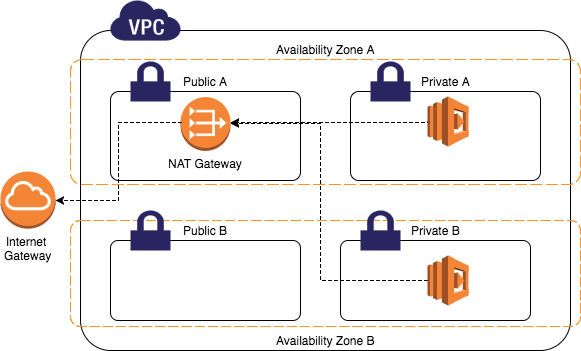

# 7. VPC와 NAT Gateway

## 배경지식

NAT Gateway는 보통 Private Subnet에 위치한 EC2 인스턴스들이  
외부 인터넷을 통해 패치, 업데이트를 받기 위해 연결하는 구성 요소입니다.



NAT Gateway는 Private subnet이 인터넷과 직접 연결되는 것을 방지하기 위해 사용합니다.

## 학습하기

### init, plan, apply

```bash
$ terraform init

Initializing the backend...

Initializing provider plugins...
- Finding latest version of hashicorp/aws...
- Installing hashicorp/aws v4.17.1...
- Installed hashicorp/aws v4.17.1 (signed by HashiCorp)

Terraform has created a lock file .terraform.lock.hcl to record the provider
selections it made above. Include this file in your version control repository
so that Terraform can guarantee to make the same selections by default when
you run "terraform init" in the future.

Terraform has been successfully initialized!

You may now begin working with Terraform. Try running "terraform plan" to see
any changes that are required for your infrastructure. All Terraform commands
should now work.

If you ever set or change modules or backend configuration for Terraform,
rerun this command to reinitialize your working directory. If you forget, other
commands will detect it and remind you to do so if necessary.

```

```bash
$ terraform plan
...

Plan: 18 to add, 0 to change, 0 to destroy.

───────────────────────────────────────────────────────────────────

Note: You didn't use the -out option to save this plan, so
Terraform can't guarantee to take exactly these actions if you run
"terraform apply" now.
```

18개의 리소스가 서울 리전에 생성될 예정입니다.

```bash
$ terraform apply
...

Plan: 18 to add, 0 to change, 0 to destroy.

Do you want to perform these actions?
  Terraform will perform the actions described above.
  Only 'yes' will be accepted to approve.

  Enter a value: yes
```

VPC, Subnet, Nat Gateway 등이 구성됩니다.

```bash
...
aws_nat_gateway.nat-gw: Still creating... [10s elapsed]
aws_nat_gateway.nat-gw: Still creating... [20s elapsed]
aws_nat_gateway.nat-gw: Still creating... [30s elapsed]
aws_nat_gateway.nat-gw: Still creating... [40s elapsed]
aws_nat_gateway.nat-gw: Still creating... [50s elapsed]
aws_nat_gateway.nat-gw: Still creating... [1m0s elapsed]
aws_nat_gateway.nat-gw: Still creating... [1m10s elapsed]
aws_nat_gateway.nat-gw: Still creating... [1m20s elapsed]
aws_nat_gateway.nat-gw: Still creating... [1m30s elapsed]
aws_nat_gateway.nat-gw: Still creating... [1m40s elapsed]
aws_nat_gateway.nat-gw: Creation complete after 1m45s [id=nat-0ca19d70c69f20e30]
...

Apply complete! Resources: 18 added, 0 changed, 0 destroyed.
```

NAT Gateway는 VPC나 Subnet에 비해 생성 시간이 오래 걸립니다.  
제 경우는 NAT Gateway를 생성하는 데 1분 45초가 걸렸네요.

다음 과정에서는 이 생성한 VPC, Subnet 안에 EC2 인스턴스를 배포하는 방법을 알아보겠습니다.
